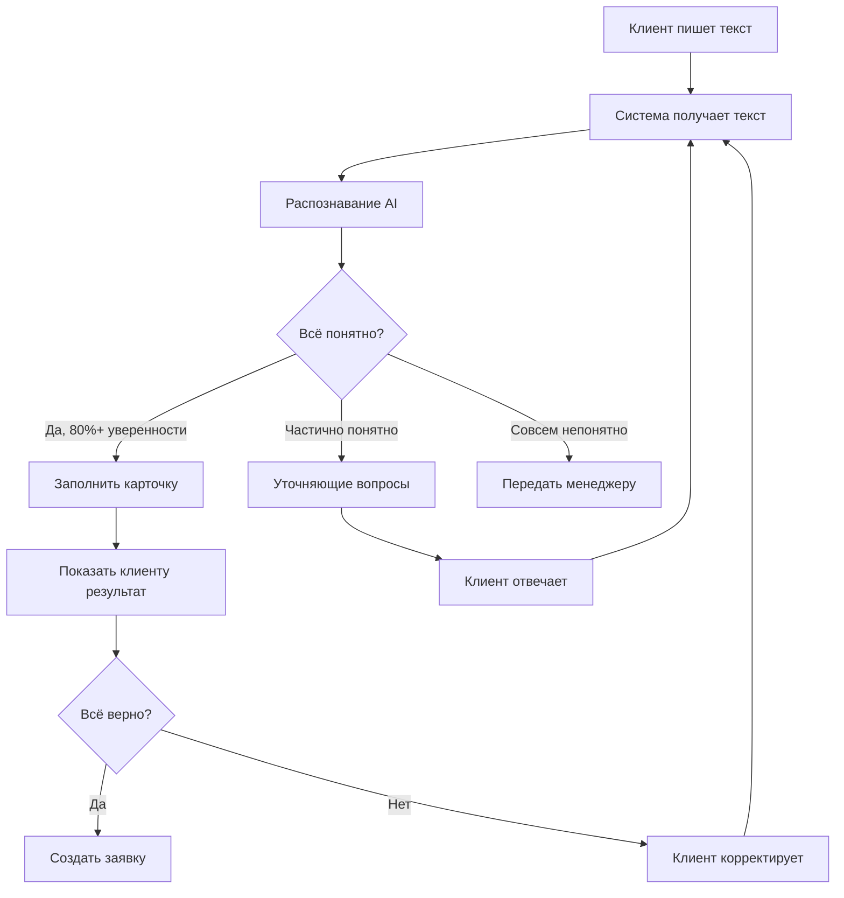

# Интеллектуальное распознавание заявок

## Проблема

**Сейчас (типичная форма заказа):**
- Клиент должен заполнить 15-20 полей
- Обязательные поля, выпадающие списки
- Клиент не понимает термины ("фацет", "еврокромка")
- Забывает указать важные детали
- Бросает форму на середине - слишком сложно

**Наше решение:**
- Клиент пишет как хочет: "Нужно зеркало на стену, примерно метр на полтора, с лампочками по краям"
- Система понимает, что имеется в виду
- Извлекает: размеры ~1000×1500 мм, тип: настенное, опция: подсветка по периметру
- Переспрашивает только если что-то критично непонятно

---

## Как клиент может отправить заявку

### Способ 1: Текстом (самое простое)

**Поле ввода на сайте:**
```
Опишите, что вам нужно:
_________________________________________________
_________________________________________________
_________________________________________________

Примеры:
• "Зеркало в ванную 60 на 80, с полочкой"
• "Круглое зеркало диаметром 70 см с подсветкой"
• "Стеклянная полка 100х30, прозрачная"
```

**Что пишет клиент (примеры реальных запросов):**
- "Мне нужно зеркало на всю стену в прихожую, примерно 2 метра на метр, чтобы красиво смотрелось"
- "Зеркало круглое, сантиметров 50-60, с лампочками как в гримерке"
- "Нужна стеклянная дверца для шкафа, 40х60, матовая"
- "Хочу такое же зеркало как у соседей, фото прилагаю"

### Способ 2: Голосом

**Кнопка "Сказать голосом" на сайте:**
- Клиент нажимает и говорит
- Система переводит речь в текст
- Затем распознает как обычный текст

**Пример:**
> "Мне нужно... ну... зеркало такое... большое... на стену в спальню... ну метра два наверное... и чтоб с подсветкой... ну как в магазинах делают..."

### Способ 3: Через мессенджеры (Telegram, WhatsApp)

**Клиент пишет боту:**
```
Клиент: Привет! Мне нужно зеркало

Бот: Здравствуйте! Расскажите подробнее, что именно нужно?

Клиент: Ну в ванную зеркало. 80 на 60 где-то. 
        С лампочками по бокам хочу.

Бот: Понял! Зеркало прямоугольное 80×60 см с боковой подсветкой.
     Будет стоить примерно 12,000₽. Уточнить детали?
```

### Способ 4: Фото чертежа или эскиза

**Клиент прикладывает:**
- Фото рукописного эскиза
- Скриншот из интернета
- Фотографию похожего изделия

**Система:**
- Распознает изображение
- Извлекает размеры (если есть)
- Определяет форму, тип
- Спрашивает недостающее

---

## Что система умеет распознавать

### 1. Размеры в любом формате

Клиент может написать как угодно:

| Что написал клиент | Что поняла система |
|-------------------|-------------------|
| "метр на полтора" | 1000×1500 мм |
| "80 на 60" | 800×600 мм |
| "восемьдесят сантиметров" | 800 мм |
| "2х1.5 метра" | 2000×1500 мм |
| "диаметр 50" | Ø500 мм (круглое) |
| "примерно 60-70 см" | ~600-700 мм (диапазон) |

### 2. Форма изделия

| Что написал | Что поняла |
|------------|-----------|
| "обычное", "стандартное" | Прямоугольное |
| "круглое", "кругляш" | Круглое |
| "овал", "овальное" | Овальное |
| "необычной формы", "фигурное" | Фигурное (уточнить эскиз) |
| "с закругленными углами" | Прямоугольное со скругленными углами |

### 3. Тип обработки и опции

| Что написал | Что поняла |
|------------|-----------|
| "с лампочками", "с подсветкой", "светящееся" | LED подсветка |
| "красивые края", "обработанные края" | Полировка кромки |
| "скошенные края", "со скосом" | Фацет |
| "нужна полочка" | Стеклянная полка в комплекте |
| "чтоб повесить", "с креплениями" | Крепления в комплекте |
| "с дырками для саморезов" | Сверление отверстий |

### 4. Назначение (откуда понимает детали)

| Где будет | Что подразумевается |
|----------|-------------------|
| "в ванную" | Влагостойкое, скорее всего с подсветкой |
| "в прихожую" | Настенное, в полный рост |
| "для шкафа-купе" | Дверь-купе, нужны размеры проема |
| "на туалетный столик" | С подсветкой (гримерное) |
| "в спортзал" | Большое настенное |

### 5. Стиль и предпочтения

| Описание | Интерпретация |
|----------|--------------|
| "как в магазинах", "гримерное" | Подсветка по периметру |
| "минималистичное" | Без декора, простая форма |
| "красивое", "необычное" | Предложить варианты с фацетом, подсветкой |
| "простое, недорогое" | Базовая комплектация |
| "премиум", "класс люкс" | Все опции, качественные материалы |

---

## Как работает распознавание

### Процесс обработки заявки:



### Пример работы:

**Клиент пишет:**
```
Нужно зеркало в ванную, метр на 80, с лампочками по краям
```

**Система анализирует:**
```yaml
Распознано:
  Тип изделия: Зеркало (уверенность: 100%)
  Назначение: Ванная комната (уверенность: 100%)
  Размеры: 1000×800 мм (уверенность: 95%)
  Опции: 
    - LED подсветка по периметру (уверенность: 90%)
  
Не распознано:
  - Толщина материала (спросить? нет, стандарт 4мм)
  - Тип крепления (спросить? нет, предложим варианты)
  - Ориентация (вертикально/горизонтально) - НУЖНО СПРОСИТЬ
```

**Система показывает клиенту:**
```
✓ Зеркало для ванной комнаты
✓ Размер: 1000×800 мм
✓ С LED-подсветкой по периметру

Уточните, пожалуйста:
Как будет висеть зеркало?
○ Вертикально (высота 100 см)
○ Горизонтально (ширина 100 см)

[Продолжить]
```

---

## Реализация в разных вариантах

### Вариант 1: Битрикс24 (базовое распознавание)

**Что используется:**
- Веб-форма с текстовым полем
- Простые правила распознавания (регулярные выражения)
- Встроенная логика Битрикс

**Как работает:**
1. Клиент вводит текст
2. Битрикс ищет ключевые слова и числа
3. Заполняет поля автоматически где может
4. Остальное передает менеджеру

**Возможности:**
- Распознавание размеров (числа)
- Ключевые слова: "зеркало", "стекло", "круглое"
- Базовая логика

**Ограничения:**
- Не понимает сложные фразы
- Не учится на ошибках
- Ограниченный словарь
- Нужно много ручной работы менеджера

---

### Вариант 2: Гибридное решение (умное распознавание)

**Что используется:**
- Собственный сервис распознавания
- Открытые AI-модели (можно бесплатно)
- Обучение на ваших данных

**Как работает:**
1. Клиент вводит текст (или голос → текст)
2. Текст отправляется в AI-сервис
3. AI анализирует и извлекает информацию:
   - GPT-подобная модель для понимания текста
   - Можно использовать YandexGPT или локальную модель
4. Система заполняет карточку заказа
5. Показывает клиенту для подтверждения

**Возможности:**
- Понимание естественного языка
- Распознавание синонимов и жаргона
- Извлечение размеров в любом формате
- Обработка голосового ввода (Speech-to-Text)
- Распознавание изображений (OCR для эскизов)
- Обучение на ваших данных

**Примеры инструментов:**
- Текст → Структура: YandexGPT API (платно) или Ollama (бесплатно, локально)
- Голос → Текст: Yandex SpeechKit или Whisper (OpenAI, можно локально)
- Фото → Текст: Google Vision API или Tesseract OCR

**Стоимость AI:**
- YandexGPT: ~1₽ за 1000 символов
- Локальные модели (Ollama, LLaMA): бесплатно, свой сервер

---

### Вариант 3: Полностью своя система (максимальный AI)

**Что используется:**
- Специально обученная AI-модель
- Интеграция с лучшими AI-сервисами
- Самообучающаяся система

**Как работает:**
1. Мультимодальный ввод:
   - Текст
   - Голос
   - Фото/скан
   - Видео-объяснение (клиент снимает помещение)
2. AI-анализ на нескольких уровнях:
   - Понимание намерений
   - Извлечение параметров
   - Определение недостающего
   - Предложение улучшений
3. Умные вопросы (только самое важное)
4. Автоматический расчет стоимости
5. Предложение альтернатив

**Продвинутые возможности:**
- **Понимание контекста:** "Такое же, как заказывал прошлый раз, но больше" → система знает предыдущий заказ
- **Умные подсказки:** Клиент пишет "в ванную" → система предлагает влагостойкое зеркало
- **Анализ фото помещения:** Клиент присылает фото стены → система предлагает оптимальный размер
- **Распознавание чертежей:** Система читает рукописные эскизы с размерами
- **Голосовой диалог:** Можно разговаривать как с менеджером
- **Обучение на истории:** Система учится на успешных заказах

**AI-стек:**
- GPT-4 или Claude для понимания текста
- Whisper для голоса
- GPT-4 Vision для анализа фото
- Собственная модель, обученная на ваших данных

---

## Примеры распознавания

### Простой запрос

**Клиент:**
> "Зеркало 80х60 с подсветкой"

**Система распознала:**
```yaml
✓ Тип: Зеркало
✓ Размер: 800×600 мм
✓ Опции: LED-подсветка
✓ Уверенность: 95%

Уточнить:
? Где подсветка: по периметру / сверху?
  Предлагаем: по периметру (популярнее)
```

---

### Сложный запрос

**Клиент:**
> "Мне нужно в ванную зеркало, ну не знаю точно, но стена у меня метра два наверное, хочу на всю стену, ну может чуть меньше оставить. И чтоб с лампочками было, как в салонах красоты. А еще полочку можно сделать?"

**Система распознала:**
```yaml
✓ Тип: Зеркало настенное
✓ Помещение: Ванная комната
✓ Размер: ~1800-2000×900-1200 мм (оценочно)
✓ Опции: 
  - LED-подсветка по периметру ("как в салонах")
  - Стеклянная полочка
✓ Уверенность: 75%

Требуется уточнение:
! Точные размер стены (замерить)
? Ширина зеркала (вся стена или оставить отступы?)
? Размер полочки (ширина, глубина)

Рекомендация: Выезд замерщика БЕСПЛАТНО
```

**Система сразу предлагает:**
```
Мы подготовили для вас примерный расчет:

Зеркало на всю стену в ванную
~ 1900×1000 мм
+ LED-подсветка теплый белый
+ Стеклянная полочка 600мм

Примерная стоимость: 25,000-30,000 ₽
Точный расчет после замера (бесплатно)

[Заказать замер] [Уточнить самому]
```

---

### Совсем вольный запрос

**Клиент:**
> "Хочу как у Ивановых, было у них в гостях, такое красивое зеркало огромное, светится прям. Можете такое? 😍"

**Система распознала:**
```yaml
✓ Тип: Зеркало
✓ Особенность: Большое, с подсветкой
✓ Контекст: Увидел у знакомых
✗ Размеры: не указаны
✗ Детали: неизвестны
✓ Уверенность: 40% - НИЗКАЯ

Действие: Умный диалог
```

**Система отвечает:**
```
Здорово! 😊 Такие зеркала мы делаем!

Чтобы сделать точно такое же или похожее, 
подскажите:

1. Примерный размер? (метр на два / восемьдесят на метр / другое)
2. Где висело? (вертикально на стене / горизонтально)
3. Можете сфотографировать или показать похожее фото?

Или могу предложить наши популярные варианты 
больших зеркал с подсветкой 👇

[Посмотреть примеры]
```

---

### Запрос с фото

**Клиент присылает:**
- Фото рукописного эскиза
- Подпись: "Вот примерно что нужно"

**Система делает:**
1. Распознает изображение (компьютерное зрение)
2. Извлекает размеры с эскиза
3. Определяет форму
4. Видит пометки

**Результат:**
```yaml
✓ Распознано с фото:
  - Прямоугольное зеркало
  - Размеры: 1200×900 мм (рукописно)
  - Пометки: "подс ветка с верху"
  - Пометка: "4 дырки по углам"
  
✓ Интерпретация:
  - Подсветка сверху (линейная)
  - Сверление 4 отверстий для крепления
```

**Система  отвечает клиенту:**
```
Отлично! Я понял с эскиза:

✓ Зеркало 1200×900 мм
✓ Подсветка сверху
✓ 4 отверстия по углам для креплений

Всё верно?

[Да, всё верно] [Исправить]
```

---

## Преимущества для клиента

### Было (обычная форма):
- ❌ 15-20 полей для заполнения
- ❌ Обязательные поля, нельзя пропустить
- ❌ Непонятные термины
- ❌ Долго (5-10 минут)
- ❌ Много клиентов бросают форму

### Стало (с AI-распознаванием):
- ✅ Одно поле: "Опишите, что нужно"
- ✅ Пишешь как хочешь, своими словами
- ✅ Можно сказать голосом
- ✅ Можно отправить фото эскиза
- ✅ Быстро (30-60 секунд)
- ✅ **Конверсия заявок +60%**

---

## Сравнение вариантов

| Возможность | Битрикс | Гибрид | Своя система |
|------------|---------|--------|--------------|
| **Текст свободной формой** | Базово | ✅ Отлично | ✅ Максимально |
| **Распознавание размеров** | Простые числа | Любые форматы | Любые + контекст |
| **Синонимы и жаргон** | Ограничено | ✅ Да | ✅ Полностью |
| **Голосовой ввод** | Нет | ✅ Да | ✅ Да + диалог |
| **Распознавание фото** | Нет | Базово (OCR) | ✅ Полное (AI Vision) |
| **Обучение на данных** | Нет | Можно настроить | ✅ Автоматическое |
| **Понимание контекста** | Нет | Частично | ✅ Полное |
| **Умные вопросы** | Нет | Да | ✅ Адаптивные |
| **Стоимость внедрения** | Низкая | Средняя | Высокая |
| **Качество распознавания** | 60-70% | 85-90% | 95-98% |

---

## Что нужно для внедрения

### Вариант 1: Битрикс (базовое)
- ✓ Настроить текстовое поле в форме
- ✓ Написать правила распознавания (регулярные выражения)
- ✓ Обучить менеджеров дорабатывать заявки
- **Время:** 1-2 недели
- **Стоимость:** Минимальная (входит в разработку)

### Вариант 2: Гибрид (умное)
- ✓ Интегрировать AI-сервис (YandexGPT или локальный)
- ✓ Настроить промпты для распознавания
- ✓ Обучить на примерах ваших заказов (50-100 шт.)
- ✓ Подключить Speech-to-Text для голоса
- ✓ Настроить OCR для фото
- **Время:** 3-4 недели
- **Стоимость AI:** 
  - Cloud (YandexGPT): ~5-10k₽/мес
  - Локально (Ollama): 0₽, свой сервер

### Вариант 3: Своя система (максимум)
- ✓ Обучить собственную AI-модель
- ✓ Собрать датасет из ваших заказов (500+ шт.)
- ✓ Настроить мультимодальный ввод
- ✓ Реализовать голосового помощника
- ✓ Внедрить компьютерное зрение
- ✓ Система самообучения
- **Время:** 2-3 месяца (разработка AI-части)
- **Стоимость AI:** 
  - GPT-4 API: ~20-50k₽/мес (зависит от объема)
  - Собственная модель: единоразово дороже, потом бесплатно

---

## Метрики успеха

### Конверсия заявок:
- **Было:** 100 посетителей → 15 заполненных форм = 15%
- **Стало:** 100 посетителей → 40 заявок = 40% (+167%!)

### Время заполнения:
- **Было:** 5-10 минут (многие бросают)
- **Стало:** 30-60 секунд

### Качество заявок:
- **Было:** 40% заявок неполные, нужно уточнять
- **Стало:** 90% заявок с достаточной информацией

### Нагрузка на менеджеров:
- **Было:** Каждую заявку дорабатывать вручную
- **Стало:** 85% заявок готовы сразу

---

*Интеллектуальное распознавание заявок - это ключ к удобству клиента и росту конверсии. Современные AI-технологии делают сложные формы ненужными.*
