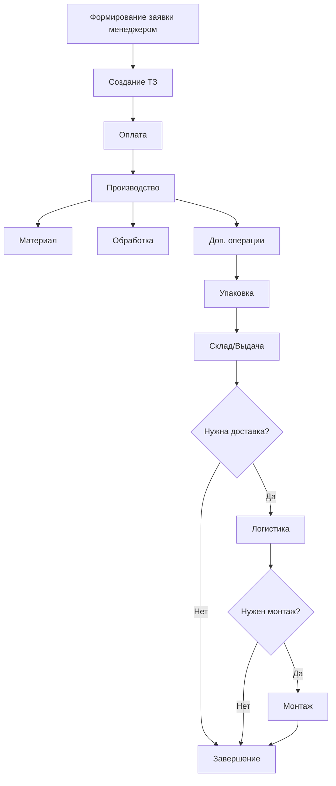

# Анализ проблематики и текущего состояния

## Заказчик

**Компания:** Производственная компания Марата Гайнуловича  
**Сфера деятельности:** Производство зеркал и стекол под индивидуальные размеры

## Описание бизнеса

Компания специализируется на изготовлении индивидуальных зеркал и стекол с широким спектром параметров:

- Различные формы и размеры
- Различные виды обработки
- С подсветкой и без подсветки
- Дополнительные опции (сверление, крепления и другие)

**Сегменты клиентов:**

- **B2B:** Мебельные компании, дизайнерские бюро, архитектурные и строительные организации
- **B2C:** Частные лица через веб-сайт

## Текущая ситуация

### Проблемы управления производством

> [!WARNING]
> Критические проблемы текущего состояния системы управления

1. **Отсутствие централизованной IT-системы**
   - Весь учет ведется в электронных таблицах
   - Нет единой системы управления производством
   - Электронные таблицы не справляются с масштабом операций

2. **Проблемы с Битрикс24**
   - Система используется, но не выполняет основные задачи
   - Плохо справляется с отслеживанием статусов заявок
   - Не обеспечивает контроль прохождения производственного цикла

3. **Отсутствие прозрачности процессов**
   - Руководство не имеет четкого представления о производственных процессах
   - Нет возможности оперативного мониторинга
   - Сложно контролировать загрузку производства

4. **Разрозненные каналы коммуникации**
   - Множество каналов приема заявок не интегрированы между собой
   - Отсутствует единая точка входа для заказов
   - Нет автоматизированного информирования клиентов

## Бизнес-процесс производства

### Текущий производственный цикл

**Этапы производства:**

1. Формирование заявки менеджером, создание технического задания
2. Оплата (через банковское приложение или счет для юридических лиц)
3. Производство:
   - Выбор и подготовка материала
   - Обработка
   - Дополнительные операции (сверление, установка креплений, монтаж подсветки)
4. Упаковка и фиксация готовности
5. Размещение на складе/выдача клиенту
6. Логистика (опционально)
7. Монтаж (опционально)

## Ключевые проблемы

### Организационные

| Проблема                                 | Последствия                                              |
| ---------------------------------------- | -------------------------------------------------------- |
| Зависимость от электронных таблиц        | Высокий риск ошибок, сложность масштабирования           |
| Отсутствие единой точки входа для заявок | Потеря заявок, дублирование информации                   |
| Отсутствие прозрачности процессов        | Невозможность оперативного управления производством      |
| Ручное информирование клиентов           | Большие временные затраты, риск забыть уведомить клиента |

### Технические

- Битрикс24 не решает задачи производственного учета
- Нет интеграции между каналами приема заявок
- Отсутствует автоматизация статусов заказов
- Нет производственной карточки заказа

## Требуемое решение

### Главная цель

> [!IMPORTANT]
> Создание единой IT-системы для полного цикла управления заказами от приема заявки до выдачи готовой продукции с полным отказом от электронных таблиц

### Основные задачи

1. **Централизация приема заявок**
   - Сбор и формирование заявок из всех каналов
   - Единая база данных заказов
2. **Управление производством**
   - Формирование производственных карточек
   - Проведение заявки через все этапы производства
   - Отслеживание и обновление статусов

3. **Интеграция с существующими системами**
   - Интеграция с Битрикс24 CRM
   - Подключение платежных систем
   - Интеграция с каналами коммуникации

4. **Коммуникация и информирование**
   - Автоматическое информирование менеджеров
   - Автоматическое информирование клиентов о статусе заказа
   - Прозрачность для руководства

## Требования к решению

### Функциональные требования по ролям

**Менеджеры:**

- Создание и редактирование заявок
- Формирование технического задания
- Просмотр статусов и истории заказов
- Инструменты для информирования клиентов

**Производственный персонал:**

- Получение производственных карточек с техническим заданием
- Обновление статусов выполнения
- Просмотр очереди заказов
- Фиксация завершения этапов

**Руководитель:**

- Мониторинг всех процессов в реальном времени
- Аналитика и отчетность
- Контроль загрузки производства

**B2B клиенты:**

- Личный кабинет (обсуждается)
- Информирование о статусе заказа
- История заказов и отслеживание

**B2C клиенты:**

- Уведомления о статусе заказа
- Информация о готовности продукции

### Технические требования

**Интеграции (обязательные):**

- Битрикс24
- Email
- Веб-форма на сайте
- Платежные системы

**Интеграции (желательные):**

- Telegram
- WhatsApp
- Avito
- ВКонтакте

**Каналы информирования:**

- SMS
- Telegram
- WhatsApp
- Email

## Открытые вопросы

1. Необходимость полноценного личного кабинета для B2B клиентов
2. Приоритизация каналов приема заявок
3. Выбор платежных систем и способы интеграции
4. Функциональность Telegram-бота (информирование или полноценный канал заказа)

## Критерии успеха проекта

- ✓ Полный отказ от электронных таблиц
- ✓ Централизованный прием заявок из всех каналов
- ✓ Прозрачность производственных процессов для руководства
- ✓ Автоматизация информирования клиентов и менеджеров
- ✓ Сокращение времени обработки заявок
- ✓ Снижение количества ошибок в производстве
- ✓ Масштабируемость решения для роста бизнеса

## Сроки

**Крайний срок предоставления коммерческого предложения:** до 23.11.2025 (до конца понедельника)

## Ожидаемые результаты от исполнителя

1. Описание архитектуры и технологий решения
2. Минимум 2 варианта реализации
3. Оценка реализуемости и анализ рисков
4. Финансовая часть:
   - Стоимость разработки
   - Стоимость сопровождения
   - Стоимость будущих изменений
5. Реалистичные сроки реализации

---

_Документ составлен на основе технического задания и требует дополнительного уточнения деталей на очной встрече с заказчиком._
