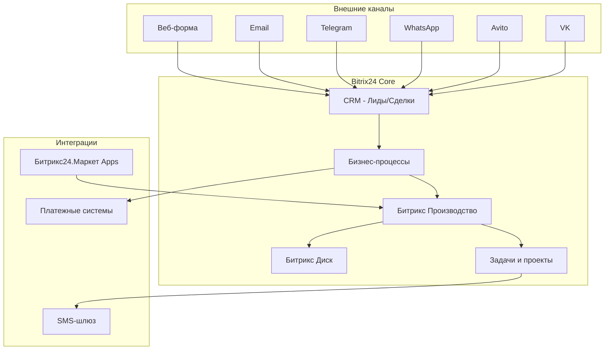
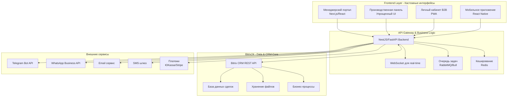
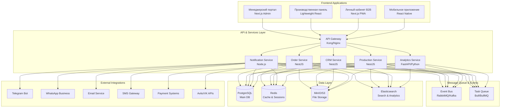

# Варианты решения задачи управления производством

## Обзор вариантов

Предлагается три различных подхода к решению проблем управления производством заказов:

1. **Bitrix-центричное решение** — максимальное использование возможностей Битрикс24
2. **Гибридное решение** — Битрикс как backend/CRM, специализированный frontend
3. **Независимое решение** — полностью кастомная разработка без Битрикс

---

## Вариант 1: Bitrix-центричное решение

### Описание подхода

Полноценное использование экосистемы Битрикс24 с максимальной доработкой стандартного функционала под специфику производства.

### Архитектура

### Технологический стек

**Основа:**

- Bitrix24 (коробочная или облачная версия)
- Битрикс Производство (модуль)
- Битрикс CRM
- Битрикс Бизнес-процессы

**Доработки:**

- PHP (1C-Bitrix Framework)
- REST API Битрикс24
- JavaScript (для интерфейсных доработок)
- Apps из Битрикс24.Маркет

**Интеграции:**

- REST API для внешних каналов
- Webhooks для уведомлений
- Email/SMS шлюзы

### Реализация ключевых требований

| Требование                     | Решение в Битрикс                             |
| ------------------------------ | --------------------------------------------- |
| Прием заявок из разных каналов | CRM - мультиканальность + REST API интеграции |
| Производственная карточка      | Модуль "Производство" + кастомные поля сделки |
| Статусы и этапы                | Воронка продаж + бизнес-процессы              |
| Информирование клиентов        | Автоматизация + триггеры бизнес-процессов     |
| Личный кабинет B2B             | Экстранет Битрикс24                           |
| Аналитика для руководителя     | CRM Аналитика + кастомные отчеты              |
| Интеграция с платежами         | REST API + готовые модули из маркета          |

### Преимущества

> [!NOTE]
> Ключевые преимущества Bitrix-центричного подхода

- **Быстрый старт** — базовая инфраструктура уже есть
- **Минимальная разработка** — максимум настройки и конфигурации
- **Единая экосистема** — все в одном месте (CRM, производство, коммуникации)
- **Готовая интеграция** — каналы связи уже интегрированы в Битрикс
- **Техподдержка** — официальная поддержка от 1C-Bitrix
- **Масштабируемость** — проверенное enterprise-решение
- **Быстрое обучение** — знакомый интерфейс для персонала

### Недостатки и ограничения

> [!WARNING]
> Критические ограничения подхода

- **Жесткость платформы** — сложно адаптировать под нестандартные процессы
- **Производительность** — Битрикс требователен к ресурсам сервера
- **Стоимость лицензий** — высокая стоимость при масштабировании (пользователи, модули)
- **Vendor lock-in** — сильная привязка к экосистеме Битрикс
- **Ограничения кастомизации** — сложность глубокой доработки интерфейса
- **Сложность отладки** — legacy код фреймворка может усложнять разработку
- **UX ограничения** — интерфейс Битрикс может быть избыточным для производственного персонала

### Оценка сроков и стоимости

**Разработка:**

- Настройка CRM и воронок: 1-2 недели
- Настройка модуля "Производство": 2-3 недели
- Создание бизнес-процессов: 2-3 недели
- Интеграция каналов: 2-3 недели
- Кастомизация интерфейса: 1-2 недели
- Тестирование и обучение: 1-2 недели

**Итого:** 9-15 недель (2-3.5 месяца)

**Стоимость разработки:** Средняя (акцент на настройку, а не программирование)

**Сопровождение:**

- Лицензия Битрикс24 (коробка): ~150-300k₽/год в зависимости от версии
- Лицензия Битрикс24 (облако): от 11,990₽/мес (тариф "Профессиональный")
- Техническое сопровождение: от 30-50k₽/мес

### Риски

| Риск                             | Вероятность | Влияние | Митигация                             |
| -------------------------------- | ----------- | ------- | ------------------------------------- |
| Недостаточная гибкость платформы | Средняя     | Высокое | Детальное прототипирование процессов  |
| Проблемы производительности      | Средняя     | Среднее | Качественный хостинг, оптимизация     |
| Превышение бюджета на лицензии   | Низкая      | Среднее | Планирование количества пользователей |
| Сложность обучения персонала     | Средняя     | Среднее | Поэтапное внедрение с обучением       |

---

## Вариант 2: Гибридное решение

### Описание подхода

Bitrix24 сохраняется как CRM и backend для управления данными, но создается специализированный frontend-интерфейс, оптимизированный под производственные процессы.

### Архитектура

### Технологический стек

**Frontend:**

- **Менеджерский портал:** Next.js 14+ (App Router), React, TypeScript, Tailwind CSS
- **Производственная панель:** Простой React SPA с минималистичным UI
- **Личный кабинет B2B:** Next.js PWA с офлайн-возможностями
- **Мобильное приложение:** React Native (опционально)

**Backend/API:**

- **Node.js:** NestJS (TypeScript) — основной API сервер
- **Python (альтернатива):** FastAPI — для сложной бизнес-логики
- **Real-time:** Socket.io/WebSocket для live-обновлений статусов
- **Очереди:** Bull.js (Redis) / RabbitMQ для асинхронных задач
- **Кеширование:** Redis для производительности

**Bitrix Integration:**

- Bitrix24 REST API для работы с CRM
- Webhooks для событий из Битрикс
- OAuth 2.0 для авторизации

**Инфраструктура:**

- **База данных:** PostgreSQL (для кастомных данных) + Битрикс DB
- **Файловое хранилище:** S3-совместимое хранилище или Битрикс Диск
- **Контейнеризация:** Docker + Docker Compose
- **CI/CD:** GitLab CI / GitHub Actions

**Интеграции:**

- Telegram Bot API (aiogram/telegraf)
- WhatsApp Business API
- Email (SendGrid/Mailgun)
- SMS (Twilio/СМС.ру)
- Платежи (ЮKassa/CloudPayments/Stripe)

### Реализация ключевых требований

| Требование                | Решение в гибриде                                              |
| ------------------------- | -------------------------------------------------------------- |
| Прием заявок              | Кастомный API Gateway → Битрикс CRM через REST API             |
| Производственная карточка | Специализированный UI + кастомная БД + синхронизация с Битрикс |
| Статусы и этапы           | Кастомный State Machine + синхронизация с Битрикс воронкой     |
| Информирование клиентов   | Собственный микросервис уведомлений + очереди                  |
| Личный кабинет B2B        | Полностью кастомный Next.js PWA                                |
| Аналитика                 | Кастомные дашборды + BI инструменты (Metabase/Grafana)         |
| Интеграция с платежами    | Прямая интеграция через API платежных систем                   |

### Преимущества

> [!NOTE]
> Ключевые преимущества гибридного подхода

- **UX оптимизация** — интерфейс заточен под конкретные задачи каждой роли
- **Гибкость** — легко адаптировать под меняющиеся бизнес-процессы
- **Производительность** — оптимизированный frontend + кеширование
- **Современный стек** — использование актуальных технологий
- **Масштабируемость** — микросервисная архитектура
- **Мобильность** — PWA и возможность нативных приложений
- **Кастомная аналитика** — любые отчеты и дашборды
- **Использование Битрикс** — сохранение инвестиций в CRM и экосистему
- **Снижение зависимости** — постепенный уход от vendor lock-in при необходимости

### Недостатки и ограничения

> [!WARNING]
> Сложности гибридного подхода

- **Сложность разработки** — требуется больше времени и экспертизы
- **Поддержка двух систем** — Битрикс + кастомный код
- **Синхронизация данных** — необходимость консистентности между системами
- **Лицензии Битрикс** — все еще нужны, но используются не на полную
- **Обучение команды** — разработчикам нужно знать и Битрикс, и современный стек
- **Больше точек отказа** — сложнее мониторинг и отладка
- **Двойные затраты** — на Битрикс лицензии и на кастомную разработку

### Оценка сроков и стоимости

**Разработка:**

- Проектирование архитектуры и API: 2 недели
- Backend API (NestJS): 4-6 недель
- Интеграция с Битрикс REST API: 2-3 недели
- Менеджерский портал (Next.js): 4-5 недель
- Производственная панель: 3-4 недели
- Личный кабинет B2B: 3-4 недели
- Интеграция каналов и платежей: 3-4 недели
- Система уведомлений: 2 недели
- Тестирование и отладка: 3-4 недели
- Развертывание и обучение: 1-2 недели

**Итого:** 24-34 недели (6-8.5 месяцев)

**Стоимость разработки:** Высокая (полноценная разработка + интеграция)

**Сопровождение:**

- Лицензия Битрикс24: ~150-200k₽/год (меньшая версия, т.к. основной UI кастомный)
- Серверная инфраструктура: от 15-30k₽/мес
- Техническое сопровождение: от 60-100k₽/мес
- Развитие и доработки: договорная

### Риски

| Риск                              | Вероятность | Влияние | Митигация                                   |
| --------------------------------- | ----------- | ------- | ------------------------------------------- |
| Сложность синхронизации с Битрикс | Высокая     | Высокое | Четкая архитектура интеграции, тестирование |
| Изменения в API Битрикс           | Средняя     | Среднее | Версионирование API, мониторинг изменений   |
| Превышение сроков разработки      | Средняя     | Высокое | Agile, MVP-подход, поэтапное внедрение      |
| Технический долг                  | Средняя     | Среднее | Code review, автотесты, документация        |
| Сложность найма разработчиков     | Низкая      | Среднее | Популярный стек, большое комьюнити          |

---

## Альтернативы Битриксу для гибридного подхода

В гибридном решении роль backend/CRM системы может выполнять не только Битрикс24. Рассмотрим альтернативные платформы, которые можно использовать как data layer и CRM core.

### Вариант 2A: AmoCRM + Кастомный Frontend

**Описание:**
AmoCRM — популярная российская CRM-система с хорошим REST API, более легковесная и доступная по цене, чем Битрикс24.

**Технологический стек:**

- **CRM Backend:** AmoCRM (облачная версия)
- **API:** AmoCRM REST API v4
- **Frontend:** Тот же стек, что в Варианте 2 (Next.js, React)
- **Backend:** NestJS для бизнес-логики и интеграций

**Преимущества:**

- ✅ Более простой и понятный интерфейс, чем Битрикс
- ✅ Качественное REST API с хорошей документацией
- ✅ Ниже стоимость лицензий (~1,000-3,000₽/пользователь/месяц)
- ✅ Быстрая интеграция, множество готовых виджетов
- ✅ Специализация на продажах и воронках
- ✅ Хорошая поддержка и комьюнити в РФ

**Недостатки:**

- ⚠️ Нет встроенного модуля "Производство"
- ⚠️ Меньше функциональности "из коробки" по сравнению с Битрикс
- ⚠️ Только облачная версия (нет коробочной)
- ⚠️ Vendor lock-in (меньший, чем у Битрикс)

**Оценка:**

- **Лицензия:** от 1,000₽/пользователь/месяц
- **Сроки разработки:** аналогичны Варианту 2 (6-8 месяцев)
- **Стоимость разработки:** Высокая

**Когда выбирать:**

- Нужна легковесная CRM с фокусом на продажи
- Хотите сэкономить на лицензиях CRM
- Вам важно качественное API для интеграции

---

### Вариант 2B: Odoo + Кастомный Frontend

**Описание:**
Odoo — open-source ERP/CRM система с модульной архитектурой. Включает модули для производства, продаж, складского учета.

**Технологический стек:**

- **Backend/ERP:** Odoo (Community или Enterprise)
- **Язык Odoo:** Python
- **API:** Odoo JSON-RPC / REST API
- **Frontend:** Next.js, React (кастомный)
- **Middleware:** NestJS или FastAPI

**Преимущества:**

- ✅ **Open Source** — Community версия бесплатна
- ✅ **Модуль производства** (Manufacturing) из коробки
- ✅ **ERP функциональность:** склад, закупки, бухгалтерия
- ✅ Гибкая кастомизация и расширение
- ✅ Большое комьюнити и экосистема модулей
- ✅ Подходит для производственных компаний
- ✅ Можно развернуть на своих серверах

**Недостатки:**

- ⚠️ Сложность настройки и кастомизации (требуется знание Python и Odoo framework)
- ⚠️ UX интерфейса Odoo устарел (поэтому и нужен кастомный frontend)
- ⚠️ Enterprise версия платная (~25-30€/пользователь/месяц)
- ⚠️ Требуется команда с опытом работы с Odoo
- ⚠️ API может быть менее удобным, чем у современных систем

**Оценка:**

- **Лицензия:** Community — бесплатно, Enterprise — от 25€/пользователь/месяц
- **Сроки разработки:** 7-9 месяцев (сложнее интеграция)
- **Стоимость разработки:** Высокая (нужна экспертиза в Odoo)

**Когда выбирать:**

- Нужна полноценная ERP для производства
- Хотите избежать vendor lock-in (open source)
- Готовы инвестировать в настройку Odoo
- Планируете управлять складом, закупками, производством в одной системе

---

### Вариант 2C: Supabase/Firebase + Кастомная CRM логика

**Описание:**
Использование современного Backend-as-a-Service (BaaS) вместо традиционной CRM. Вся CRM логика реализуется в кастомном коде.

**Технологический стек:**

- **BaaS:** Supabase (PostgreSQL + Auth + Storage) или Firebase
- **Backend:** NestJS с кастомной CRM логикой
- **База данных:** PostgreSQL (Supabase) или Firestore (Firebase)
- **Frontend:** Next.js, React

**Преимущества:**

- ✅ Современный стек и инструменты разработки
- ✅ Быстрая разработка backend (auth, storage из коробки)
- ✅ Real-time возможности (подписки на изменения данных)
- ✅ Масштабируемость
- ✅ Относительно низкая стоимость на начальном этапе
- ✅ Полный контроль над CRM логикой

**Недостатки:**

- ⚠️ Нужно разрабатывать всю CRM логику с нуля
- ⚠️ Нет готовых воронок продаж, этапов сделок и т.д.
- ⚠️ Vendor lock-in к Supabase/Firebase (хотя миграция проще, чем с Битрикс)
- ⚠️ Требуется сильная команда разработки

**Оценка:**

- **Стоимость BaaS:** Supabase от $25/месяц, Firebase pay-as-you-go
- **Сроки разработки:** 8-10 месяцев (больше кастомной разработки)
- **Стоимость разработки:** Очень высокая

**Когда выбирать:**

- Хотите минимизировать vendor lock-in
- Нужны real-time обновления
- CRM функциональность простая и можно реализовать с нуля
- Предпочитаете современный стек

---

### Вариант 2D: Простая комбинация (Directus/Strapi + PostgreSQL)

**Описание:**
Использование headless CMS как admin панели для управления данными, с кастомным frontend.

**Технологический стек:**

- **Headless CMS:** Directus или Strapi (для admin-интерфейса)
- **База данных:** PostgreSQL
- **Backend:** NestJS для бизнес-логики
- **Frontend:** Next.js

**Преимущества:**

- ✅ Быстрая разработка admin-панели
- ✅ Автоматическая генерация REST/GraphQL API
- ✅ Open source
- ✅ Гибкость в кастомизации
- ✅ Современный стек
- ✅ Легко добавлять новые поля и сущности

**Недостатки:**

- ⚠️ Нет CRM функций из коробки (все нужно реализовывать)
- ⚠️ Нет готовых воронок продаж и бизнес-процессов
- ⚠️ Требуется полная разработка CRM логики

**Оценка:**

- **Лицензия:** Open source (бесплатно)
- **Сроки разработки:** 8-10 месяцев
- **Стоимость разработки:** Очень высокая

**Когда выбирать:**

- Нужна гибкая admin-панель
- CRM функциональность минимальна
- Хотите полный контроль над данными
- Предпочитаете open source

---

### Сравнение альтернатив для гибридного подхода

| Критерий                      | Bitrix24     | AmoCRM     | Odoo         | Supabase/BaaS | Directus/Strapi |
| ----------------------------- | ------------ | ---------- | ------------ | ------------- | --------------- |
| **Стоимость лицензий/месяц**  | 12k-25k₽     | 10k-30k₽   | 0-25k₽       | $25-500       | $0              |
| **CRM из коробки**            | ⭐⭐⭐⭐⭐   | ⭐⭐⭐⭐⭐ | ⭐⭐⭐⭐     | ⭐            | ⭐              |
| **Производство из коробки**   | ⭐⭐⭐⭐     | ⭐         | ⭐⭐⭐⭐⭐   | ⭐            | ⭐              |
| **Качество API**              | ⭐⭐⭐       | ⭐⭐⭐⭐   | ⭐⭐⭐       | ⭐⭐⭐⭐⭐    | ⭐⭐⭐⭐⭐      |
| **Простота интеграции**       | ⭐⭐⭐       | ⭐⭐⭐⭐   | ⭐⭐         | ⭐⭐⭐⭐⭐    | ⭐⭐⭐⭐        |
| **Vendor Lock-in**            | Высокий      | Средний    | Низкий       | Средний       | Низкий          |
| **Open Source**               | ❌           | ❌         | ✅ Community | Частично      | ✅              |
| **Сложность настройки**       | ⭐⭐⭐       | ⭐⭐       | ⭐⭐⭐⭐⭐   | ⭐⭐          | ⭐⭐            |
| **Требуемая экспертиза**      | PHP, Битрикс | REST API   | Python, Odoo | JS/TS, SQL    | JS/TS, SQL      |
| **Подходит для производства** | ⭐⭐⭐⭐     | ⭐⭐       | ⭐⭐⭐⭐⭐   | ⭐⭐⭐        | ⭐⭐⭐          |

---

### Рекомендации по выбору альтернативы

#### Выбирайте **AmoCRM**, если:

- Основной фокус на продажах и CRM, производство — вторично
- Нужна проверенная облачная CRM с хорошим API
- Хотите сэкономить на лицензиях (vs. Битрикс)
- Важна быстрая интеграция

#### Выбирайте **Odoo**, если:

- Производство — ключевая часть бизнеса
- Нужна полноценная ERP (склад, закупки, производство)
- Готовы инвестировать в настройку и поддержку Odoo
- Хотите open source решение с большими возможностями
- Есть или можете нанять Odoo-разработчиков

#### Выбирайте **Supabase/Firebase**, если:

- CRM логика простая или уникальная
- Нужны real-time обновления
- Хотите современный стек и минимальный vendor lock-in
- Готовы разрабатывать CRM с нуля

#### Выбирайте **Directus/Strapi**, если:

- Нужна быстрая admin-панель для менеджеров
- CRM функциональность минимальна
- Хотите полный контроль и open source
- Фокус на кастомной бизнес-логике

#### Оставайтесь с **Bitrix24**, если:

- Уже используете и инвестировали в Битрикс
- Нужна максимальная функциональность из коробки
- Есть Битрикс-разработчики в команде
- Важна поддержка от вендора

---

### Наша рекомендация для данного проекта

> [!IMPORTANT]
> Рекомендуемая альтернатива для производства зеркал и стекол

**Для гибридного подхода рекомендуем: Odoo Community + Кастомный Frontend**

**Обоснование:**

1. **Производственный фокус** — Odoo имеет полноценный модуль Manufacturing
2. **Open Source** — экономия на лицензиях (~150-300k₽/год)
3. **Комплексность** — покрывает не только CRM, но и склад, закупки
4. **Гибкость** — можно кастомизировать под специфику производства
5. **Долгосрочная перспектива** — легко мигрировать на полностью независимое решение

**Альтернативный вариант (если Odoo сложен):**

- **AmoCRM + кастомный Production Service** — AmoCRM для CRM, отдельный microservice для управления производством

---

## Вариант 3: Независимое решение (без Битрикс)

### Описание подхода

Полностью кастомная разработка производственной системы управления заказами с нуля, без использования Битрикс24. Создание специализированного решения, заточенного под производство зеркал и стекол.

### Архитектура

### Технологический стек

**Frontend:**

- **Framework:** Next.js 14+ (App Router)
- **UI Library:** React 18+, TypeScript
- **Styling:** Tailwind CSS + shadcn/ui components
- **Forms:** React Hook Form + Zod validation
- **State:** Zustand/Jotai для локального стейта, React Query для серверного
- **Real-time:** Socket.io Client
- **Mobile:** React Native (Expo) для мобильного приложения

**Backend:**

- **Framework:** NestJS (TypeScript) — микросервисная архитектура
- **API Gateway:** Kong или Nginx с rate limiting
- **Валидация:** class-validator, class-transformer
- **ORM:** Prisma или TypeORM
- **Аутентификация:** JWT + Refresh Tokens, Passport.js
- **Авторизация:** RBAC (Role-Based Access Control) + CASL

**Базы данных и хранилища:**

- **Основная БД:** PostgreSQL 15+ с репликацией
- **Кеш:** Redis для сессий, rate limiting, кеширования
- **Поиск:** Elasticsearch для полнотекстового поиска
- **Файлы:** MinIO (S3-compatible) или AWS S3
- **Аналитика:** ClickHouse (опционально для больших данных)

**Message Broker & Events:**

- **RabbitMQ** или **Apache Kafka** для event-driven архитектуры
- **Bull/BullMQ** для фоновых задач и очередей

**Мониторинг и логирование:**

- **Логи:** Winston/Pino → Loki/ELK Stack
- **Метрики:** Prometheus + Grafana
- **Tracing:** Jaeger или Zipkin
- **APM:** Sentry для отслеживания ошибок

**DevOps & Infrastructure:**

- **Контейнеризация:** Docker + Docker Compose для разработки
- **Оркестрация:** Kubernetes (K8s) для production или Docker Swarm
- **CI/CD:** GitLab CI / GitHub Actions
- **IaC:** Terraform или Ansible для infrastructure as code

**Интеграции:**

- **Telegram:** aiogram (Python) или Telegraf (Node.js)
- **WhatsApp:** WhatsApp Business API (официальный или Twilio/MessageBird)
- **Email:** SendGrid / Mailgun / AWS SES
- **SMS:** Twilio / СМС.ру / SMSC.ru
- **Платежи:** ЮKassa, CloudPayments, Stripe
- **Маркетплейсы:** REST API Avito, VK API

### Реализация ключевых требований

| Требование                 | Решение без Битрикс                                                 |
| -------------------------- | ------------------------------------------------------------------- |
| Прием заявок               | Единый API Gateway + Order Service + интеграции через REST/Webhooks |
| Производственная карточка  | Production Service с кастомной моделью данных под производство      |
| Статусы и этапы            | State Machine (XState или кастомный) + Event Sourcing для истории   |
| Информирование клиентов    | Dedicated Notification Service + Template Engine + Multi-channel    |
| Личный кабинет B2B         | Полностью кастомный Next.js PWA с нужным функционалом               |
| Аналитика для руководителя | Grafana/Metabase дашборды + кастомные отчеты + real-time метрики    |
| CRM функционал             | Кастомный CRM Service (упрощенный, под специфику производства)      |
| Интеграция с платежами     | Прямая интеграция, полный контроль над процессом оплаты             |

### Преимущества

> [!NOTE]
> Ключевые преимущества независимого решения

- **Полная кастомизация** — система заточена исключительно под нужды производства
- **Оптимальная производительность** — нет лишней функциональности
- **Современный стек** — использование best practices и актуальных технологий
- **Независимость** — отсутствие vendor lock-in
- **Масштабируемость** — микросервисная архитектура легко масштабируется
- **Гибкость развития** — легко адаптировать под изменения бизнеса
- **Экономия на лицензиях** — отсутствие затрат на Битрикс
- **Идеальный UX** — UI/UX опыт, ориентированный на пользователей
- **Open Source** — возможность использования открытых инструментов
- **API-first** — простая интеграция с любыми внешними системами
- **Ownership** — полный контроль над кодом и данными

### Недостатки и ограничения

> [!WARNING]
> Критические вызовы независимого решения

- **Высокая стоимость разработки** — все функции нужно создавать с нуля
- **Длительные сроки** — полноценная разработка занимает больше времени
- **Высокая квалификация команды** — нужны опытные разработчики
- **Поддержка инфраструктуры** — требуется DevOps экспертиза
- **Больше рисков** — нет готовой проверенной платформы
- **Отсутствие CRM из коробки** — нужно реализовывать базовые CRM функции
- **Необходимость команды поддержки** — для сопровождения и развития
- **Интеграции с нуля** — все интеграции нужно разрабатывать и поддерживать

### Оценка сроков и стоимости

**MVP (Минимально жизнеспособный продукт):**

- Архитектура и проектирование: 3 недели
- Backend Services (основные): 8-10 недель
- Frontend (менеджерский портал): 6-8 недель
- Производственная панель: 4-5 недель
- Система уведомлений: 3-4 недели
- Базовые интеграции (2-3 канала): 4-5 недель
- Платежная интеграция: 2-3 недели
- Тестирование и QA: 4-5 недель
- Инфраструктура и deployment: 2-3 недели

**MVP итого:** 36-46 недель (9-11.5 месяцев)

**Полная функциональность:**

- Личный кабинет B2B: +4-6 недель
- Мобильное приложение: +8-10 недель
- Расширенная аналитика: +3-4 недели
- Дополнительные интеграции: +4-6 недель
- Advanced features: +4-6 недель

**Full version итого:** 59-78 недель (15-19 месяцев)

**Стоимость разработки:** Очень высокая (полная разработка с нуля)

**Сопровождение:**

- Серверная инфраструктура: от 30-60k₽/мес (в зависимости от нагрузки)
- Техническое сопровождение: от 100-150k₽/мес
- Развитие и новые фичи: договорная (рекомендуется выделенная команда)
- Мониторинг и DevOps: включено в сопровождение или +20-40k₽/мес

**Экономия на лицензиях:** Отсутствие затрат на Битрикс (~150-300k₽/год сэкономлено)

### Риски

| Риск                               | Вероятность | Влияние     | Митигация                                   |
| ---------------------------------- | ----------- | ----------- | ------------------------------------------- |
| Превышение сроков и бюджета        | Высокая     | Критическое | MVP-подход, Agile, поэтапное внедрение      |
| Технические сложности              | Средняя     | Высокое     | Опытная команда, архитектурное ревью        |
| Недостаточная квалификация команды | Средняя     | Критическое | Тщательный отбор, менторство, code review   |
| Проблемы масштабирования           | Низкая      | Высокое     | Правильная архитектура с самого начала      |
| Сложность поддержки                | Средняя     | Среднее     | Документация, автотесты, мониторинг         |
| Отказ от проекта до завершения     | Средняя     | Критическое | Прозрачность, регулярные демо, контроль вех |

---

## Сравнительная таблица вариантов

| Критерий                 | Bitrix-центричное  | Гибридное            | Независимое       |
| ------------------------ | ------------------ | -------------------- | ----------------- |
| **Сроки до MVP**         | 2-3.5 месяца       | 6-8.5 месяцев        | 9-11.5 месяцев    |
| **Стоимость разработки** | Средняя            | Высокая              | Очень высокая     |
| **Стоимость лицензий**   | Высокая            | Средняя              | Нет               |
| **Сопровождение/мес**    | 30-50k₽ + лицензии | 60-100k₽ + лицензии  | 100-150k₽         |
| **Гибкость**             | ⭐⭐               | ⭐⭐⭐⭐             | ⭐⭐⭐⭐⭐        |
| **UX качество**          | ⭐⭐⭐             | ⭐⭐⭐⭐             | ⭐⭐⭐⭐⭐        |
| **Vendor Lock-in**       | Высокий            | Средний              | Отсутствует       |
| **Сложность разработки** | ⭐⭐               | ⭐⭐⭐⭐             | ⭐⭐⭐⭐⭐        |
| **Масштабируемость**     | ⭐⭐⭐             | ⭐⭐⭐⭐             | ⭐⭐⭐⭐⭐        |
| **Риски проекта**        | Низкие             | Средние              | Высокие           |
| **Скорость изменений**   | Низкая             | Средняя              | Высокая           |
| **Требования к команде** | Битрикс-девелоперы | Full-stack + Битрикс | Senior full-stack |

---

## Рекомендации по выбору

### Выбирайте Вариант 1 (Bitrix), если:

- ✅ Нужен **быстрый запуск** (2-3 месяца)
- ✅ Ограниченный бюджет на разработку
- ✅ Уже используете Битрикс24 и хотите его улучшить
- ✅ Стандартные бизнес-процессы, хорошо ложатся на CRM
- ✅ Есть в команде Битрикс-разработчики
- ✅ Нет планов масштабного роста или изменения процессов

### Выбирайте Вариант 2 (Гибрид), если:

- ✅ Хотите **баланс** между скоростью и качеством
- ✅ Уже инвестировали в Битрикс, но интерфейс не устраивает
- ✅ Нужен **кастомный UX** для разных ролей
- ✅ Планируете развивать систему постепенно
- ✅ Готовы к средним срокам (6-8 месяцев)
- ✅ Важна гибкость, но хотите сохранить Битрикс как CRM
- ✅ Планируете B2B портал и мобильные приложения

### Выбирайте Вариант 3 (Независимое), если:

- ✅ Производство — **ключевая компетенция** бизнеса
- ✅ Планируете **масштабный рост** и franchising
- ✅ Нужна **полная кастомизация** под уникальные процессы
- ✅ Битрикс не устраивает принципиально
- ✅ Готовы инвестировать в долгосрочную разработку
- ✅ Есть бюджет на сильную команду разработки
- ✅ Хотите полный контроль и отсутствие vendor lock-in
- ✅ Планируете SaaS или продажу решения другим производствам

---

## Гибридный подход к внедрению

> [!TIP]
> Рекомендуемая стратегия для снижения рисков

Можно комбинировать подходы поэтапно:

**Этап 1 (Quick Win):**

- Начать с Варианта 1 — быстро настроить Битрикс
- Запустить базовую систему за 2-3 месяца
- Получить первый опыт и feedback от пользователей

**Этап 2 (Оптимизация):**

- Перейти к Варианту 2 — добавить кастомные интерфейсы
- Разработать производственную панель и личный кабинет
- Битрикс остается как CRM backend

**Этап 3 (Эволюция — опционально):**

- При необходимости мигрировать на Вариант 3
- Постепенно заменять компоненты Битрикс на кастомные
- Полная независимость через 1.5-2 года

---

_Итоговый выбор зависит от приоритетов бизнеса: скорость vs. качество vs. бюджет vs. гибкость. Рекомендуется детальное обсуждение каждого варианта с командой для принятия взвешенного решения._
