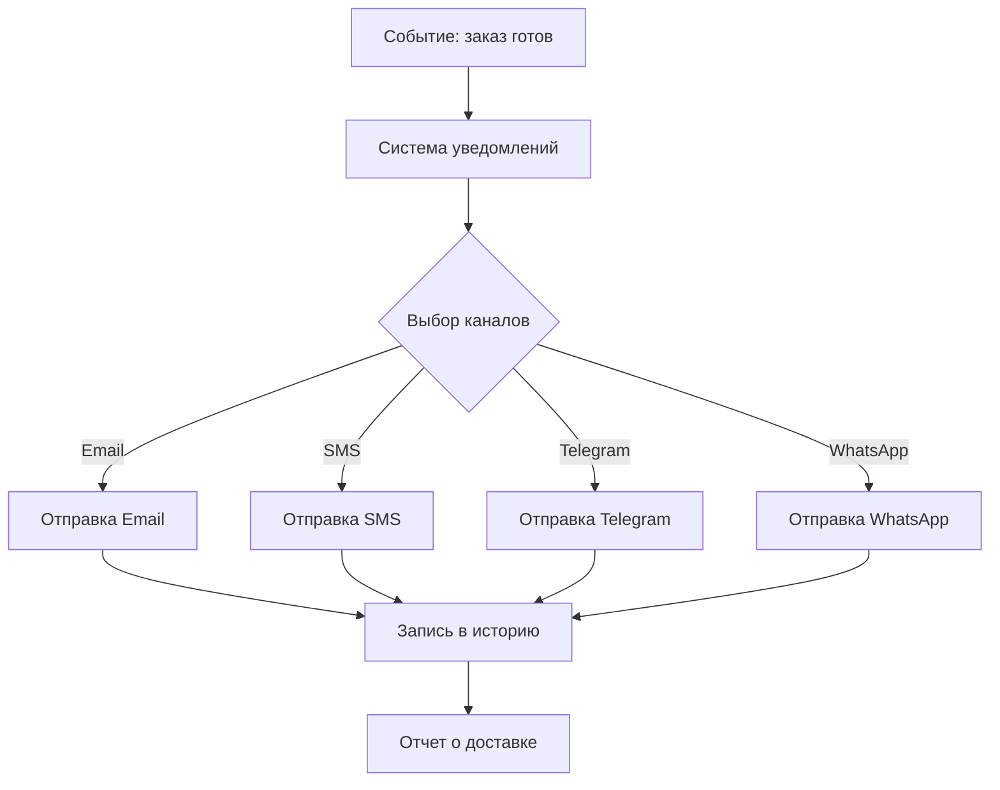

# Сценарий работы: Автоматическое информирование

## Проблема заказчика

**Сейчас (без системы):**
- Менеджеры вручную звонят и пишут клиентам о каждом изменении
- Часто забывают уведомить - клиент недоволен
- Рабочие не узнают вовремя о новых заданиях
- Руководитель не получает важных оповещений о проблемах
- Нет записи, кого и когда уведомили
- На информирование уходит 2-3 часа в день

**После внедрения системы:**
- Уведомления отправляются автоматически
- По разным каналам: SMS, Email, Telegram, WhatsApp
- Можно настроить шаблоны сообщений под себя
- Вся история уведомлений сохраняется
- Менеджеры экономят 2-3 часа ежедневно
- Клиенты всегда знают статус заказа

---

## Участники и каналы связи

| Кто | Как предпочитает получать уведомления |
|-----|--------------------------------------|
| **Клиент (частное лицо)** | SMS, Email, WhatsApp |
| **Клиент (компания)** | Email, Telegram, личный кабинет |
| **Менеджер** | Email, Telegram, уведомления в системе |
| **Рабочие в производстве** | Telegram, приложение на телефоне |
| **Руководитель** | Email для отчетов, Telegram для срочного |

---

## Какие уведомления отправляются

### Клиентам

| Когда | Что отправляется | Как |
|-------|------------------|-----|
| Заявка получена | Номер заявки, когда ждать ответа | Email + SMS |
| КП готово | Коммерческое предложение, ссылка на оплату | Email + WhatsApp |
| Оплата получена | Подтверждение, номер заказа, срок готовности | SMS + Email |
| Заказ в производстве | Что сейчас делается | SMS или Email |
| Заказ готов | Можно забирать, адрес, часы работы | SMS + WhatsApp + Email |
| Заказ выдан | Благодарность, просьба оставить отзыв | Email |
| Задержка | Извинения, новый срок, причина | SMS + WhatsApp |
| Не забрали заказ | Напоминание через 3 дня | SMS |

### Менеджерам

| Когда | Что отправляется |
|-------|------------------|
| Новая заявка | Краткая информация, ссылка на заявку |
| Заказ готов | Напоминание связаться с клиентом |
| Проблема в производстве | Описание проблемы, какой заказ |
| Клиент не забрал заказ | Напоминание позвонить |

### Рабочим в производстве

| Когда | Что отправляется |
|-------|------------------|
| Новое задание | Номер заказа, что нужно сделать |
| Срочный заказ | Приоритетное уведомление |

### Руководителю

| Когда | Что отправляется |
|-------|------------------|
| Большая задержка | Информация о проблеме |
| Брак/переделка | Какой заказ, причина |
| Ежедневно в 18:00 | Отчет за день |
| Понедельник в 9:00 | Аналитика за неделю |

---

## Пример: Уведомления по заказу #12345

### Этап 1: Клиент отправил заявку (14:35)

**Клиенту сразу приходят:**

**SMS:**
```
Кировское Стекло
Ваша заявка #12345 принята!
Менеджер позвонит в течение часа.
```

**Email:**
```
Здравствуйте, Иван Иванович!

Спасибо,  что обратились в "Кировское Стекло".

Ваша заявка #12345 получена.

Что вы заказали:
- Зеркало 800×1200 мм
- С полировкой и фацетом
- С подсветкой LED

Менеджер свяжется с вами в течение 1 часа.

С уважением,
Кировское Стекло
```

**Менеджеру в Telegram:**
```
🔔 Новая заявка #12345

👤 Иванов Иван Иванович
📞 +7 (999) 123-45-67

Зеркало 800×1200, фацет + LED
~15,000₽

[Открыть] [Позвонить]
```

---

### Этап 2: Менеджер создал КП (15:20)

**Клиенту на Email:**
```
Иван Иванович, добрый день!

Подготовили для вас предложение.

Зеркало 800×1200 мм с подсветкой
Стоимость: 15,000 ₽
Срок изготовления: 5 рабочих дней

Детали во вложении (PDF).

Оплатить можно онлайн: [ссылка]

Вопросы? Звоните!
Петрова Анна, +7 (833) 123-4567
```

**На WhatsApp (если клиент выбрал):**
```
Иван Иванович, добрый день!

КП по заказу #12345 готово 🪞

💰 15,000 ₽
⏱ 5 дней

Детали на email.
Оплатить: [ссылка]

Анна, ваш менеджер
```

---

### Этап 3: Клиент оплатил (16:45)

**Клиенту SMS:**
```
Оплата 15,000₽ получена!
Заказ #12345 в производстве.
Готовность: 02.12.2025
```

**Клиенту Email:**
```
Иван Иванович, спасибо за оплату!

Ваш заказ #12345 запущен в производство.
Будет готов: 02.12.2025

Мы сообщим вам, когда заказ будет готов.

Отследить статус: [ссылка]

С уважением,
Кировское Стекло
```

**Менеджеру в Telegram:**
```
💰 Оплата получена

#12345 - Иванов И.И.
15,000 ₽

В производство: автоматически
Готовность: 02.12
```

---

### Этап 4: Заказ в производстве

**Клиенту SMS:**
```
Заказ #12345 в работе!
Сейчас: резка материала
Готовность: 02.12
```

**Резчику в Telegram:**
```
🆕 Новое задание

Заказ #12345
Зеркало 800×1200
Срок: до 27.11

[Открыть]
```

---

###  Этап 5: Проблема! Обнаружен брак

**Менеджеру СРОЧНО в Telegram:**
```
⚠️ ПРОБЛЕМА в производстве

Заказ #12345 (Иванов И.И.)
Этап: Обработка
Проблема: Скол после резки

Переделка. Задержка: +1 день
Новый срок: 03.12

[Подробнее]
```

**Руководителю в Telegram:**
```
⚠️ Задержка #12345

Клиент: Иванов И.И.
Брак при резке
+1 день
Менеджер: Петрова А.С.
```

**После согласования с клиентом, менеджер отправляет:**

**Клиенту на WhatsApp:**
```
Иван Иванович, добрый день!

К сожалению, при изготовлении #12345 
обнаружен дефект на материале.

Переделываем бесплатно на новом материале.

Новый срок: 03.12 (задержка 1 день)

Извините за неудобства!
Скидка 5% на следующий заказ в подарок.

Анна
```

---

### Этап 6: Заказ готов! (03.12, 14:00)

**Клиенту сразу по всем каналам:**

**SMS:**
```
Ваш заказ #12345 готов! 🎉
Можно забрать:
ул. Производственная, 15
Пн-Пт 9-18, Сб 10-15
```

**Email:**
```
Иван Иванович, отличные новости!

Ваше зеркало готово!

Можно забрать:
📍 г. Киров, ул. Производственная, 15

⏰ Режим работы:
Пн-Пт: 9:00-18:00
Сб: 10:00-15:00

При получении нужен паспорт и номер: 12345

Нужна доставка? Звоните: +7 (833) 123-4567

[Фото вашего зеркала]

Ждем вас!
Кировское Стекло
```

**WhatsApp:**
```
Иван Иванович! 🎉

Ваше зеркало готово!

📍 ул. Производственная, 15
⏰ Пн-Пт 9-18, Сб 10-15

Выглядит отлично! [фото]

Анна
```

**Менеджеру в Telegram:**
```
✅ Заказ готов

#12345 - Иванов И.И.
Готов: 03.12 (задержка 1 день)

Клиент уведомлен: SMS, Email, WhatsApp

[История]
```

---

### Этап 7: Клиент не забрал через 3 дня

**Клиенту SMS:**
```
Ваш заказ #12345 ожидает!
ул. Производственная, 15
Вопросы? +7 (833) 123-4567
```

**Менеджеру в Telegram:**
```
⏰ Напоминание

Заказ #12345 не забран 3 дня
Иванов И.И.
+7 (999) 123-45-67

Позвоните клиенту?

[Позвонить]
```

---

### Этап 8: Заказ выдан и просьба об отзыве

**На следующий день Email:**
```
Иван Иванович, спасибо за заказ!

Нам важно ваше мнение.
Оцените нашу работу (1 минута):

[Оставить отзыв]

За отзыв с фото — скидка 10% на следующий заказ!

Вопросы по эксплуатации?
Мы всегда на связи.

С уважением,
Кировское Стекло
```

---

## Настройка уведомлений

### Для клиентов (в личном кабинете или при заказе):

```
Как получать уведомления?

☑ Email: ivanov@example.com
☑ SMS: +7 999 123-45-67
☑ WhatsApp: +7 999 123-45-67
☐ Telegram: [подключить]

О чем уведомлять:
☑ Заявка принята
☑ Коммерческое предложение
☑ Оплата получена
☑ Заказ готов
☑ Напоминания
☐ Акции и скидки
```

### Для менеджеров:

```
Telegram: @petrova_anna ✓
Email: petrova@kirov-steklo.ru

Уведомлять о:
☑ Новых заявках (сразу)
☑ Готовых заказах (сразу)
☑ Проблемах (срочно!)
☑ Незабранных заказах (раз в день)
☐ Еженедельный отчет

Не беспокоить:
Пн-Пт: 19:00-09:00
Сб-Вс: весь день
(кроме СРОЧНЫХ)
```

---

## Как это реализовано в разных вариантах

### Вариант 1: Решение на основе Битрикс24

**Что используется:**
- Встроенные возможности Битрикс24
- Модули для SMS и Telegram из маркета Битрикс
- Стандартные шаблоны уведомлений

**Как работает:**
1. При изменении статуса срабатывает автоматический процесс
2. Битрикс берет нужный шаблон сообщения
3. Подставляет данные клиента и заказа
4. Отправляет через подключенные сервисы

**Что можно:**
- Email (встроено)
- SMS (платные модули)
- Telegram (разработка или модуль)
- Шаблоны можно редактировать

**Особенности:**
- Всё настраивается в одном месте
- Простые шаблоны
- Ограниченные возможности персонализации

---

### Вариант 2: Гибридное решение (свой сервис уведомлений)

**Что используется:**
- Собственный сервис рассылки
- Подключение к SMS-провайдерам
- Telegram Bot
- WhatsApp Business API
- Email-сервисы

**Как работает:**
1. Система фиксирует событие (например, "заказ готов")
2. Отправляет сигнал в сервис уведомлений
3. Сервис выбирает нужный шаблон
4. Подставляет данные (имя, номер заказа и т.д.)
5. Отправляет по всем выбранным каналам
6. Сохраняет, что и когда отправлено

**Что можно:**
- Email, SMS, Telegram, WhatsApp
- Сложные шаблоны с условиями
- Если одно не дошло - отправить другим способом
- A/B тестирование (какой текст лучше)
- Статистика: сколько прочитано, открыто

**Особенности:**
- Гибкие настройки
- Можно добавить любой канал
- Умная маршрутизация (резервные каналы)

---

### Вариант 3: Полностью своя система

**Что используется:**
- Продвинутый сервис уведомлений
- Интеграция со всеми возможными каналами
- Умные алгоритмы персонализации

**Как работает:**
1. Событие попадает в систему
2. Система анализирует:
   - Кто клиент (новый/постоянный)
   - Какой канал он предпочитает
   - В какое время лучше отправить
   - Какой текст ему подойдет
3. Подбирает оптимальный вариант сообщения
4. Отправляет в лучшее время
5. Отслеживает доставку и прочтение
6. Анализирует эффективность

**Что можно:**
- Все каналы
- Персонализация под каждого клиента
- Отправка в оптимальное время
- Умное резервирование (не дошло SMS → WhatsApp)
- Голосовые уведомления
- Push-уведомления в приложении
- Любые шаблоны
- Машинное обучение (какие тексты работают лучше)

**Особенности:**
- Максимальная гибкость
- Предиктивная аналитика
- Интеграция с чем угодно
- Полный контроль

---

## Схема работы уведомлений



---

## Сравнение вариантов решения

### Таблица: Возможности

| Критерий | Вариант 1: Битрикс | Вариант 2: Гибрид | Вариант 3: Своя система |
|----------|-------------------|-------------------|------------------------|
| **Каналы** | Email, SMS, Telegram (базово) | Все популярные | Любые + новые |
| **Шаблоны** | Простые | Гибкие | Максимально гибкие |
| **Персонализация** | Базовая (имя, номер) | Хорошая | Полная (с умными алгоритмами) |
| **Время отправки** | Сразу | Настраиваемое | Оптимальное (система сама подбирает) |
| **Аналитика** | Базовая | Хорошая | Полная |
| **Резервные каналы** | Нет | Да | Да (умные) |
| **Тестирование текстов** | Нет | Можно добавить | Есть (A/B тесты) |

### Таблица: Преимущества и недостатки

| Вариант | ✅ Преимущества | ⚠️ Недостатки |
|---------|----------------|---------------|
| **1. Битрикс24** | • Быстрая настройка<br>• Всё в одной системе<br>• Простые шаблоны<br>• Не нужна разработка<br>• Готовые модули для SMS | • Ограниченная персонализация<br>• Нет умной маршрутизации<br>• Платные модули для каналов<br>• Простая аналитика<br>• Сложно добавить новые каналы |
| **2. Гибридное** | • Много каналов<br>• Гибкие шаблоны<br>• Резервные каналы<br>• Хорошая аналитика<br>• Можно добавлять функции<br>• История всех уведомлений | • Дольше настройка<br>• Нужны разработчики<br>• Отдельная система для настройки |
| **3. Полностью своя** | • Любые каналы<br>• Максимальная персонализация<br>• Умные алгоритмы<br>• A/B тесты<br>• Предсказание лучшего времени<br>• Детальная аналитика<br>• Полный контроль | • Самая дорогая разработка<br>• Длительное внедрение<br>• Нужна команда для поддержки<br>• Всё настраивается вручную |

### Таблица: Для кого подходит

| Вариант | Рекомендуется, если: |
|---------|---------------------|
| **Битрикс24** | • Нужны базовые уведомления<br>• Email и SMS достаточно<br>• Простые тексты без сложной логики<br>• Малый объем заказов (до 100 в месяц)<br>• Хотите быстро запустить |
| **Гибридное** | • Важна мультиканальность<br>• Нужны гибкие тексты сообщений<br>• Хотите аналитику<br>• Разные сообщения для разных клиентов<br>• Планируете добавлять каналы |
| **Своя система** | • Коммуникация с клиентами критична<br>• Нужна максимальная персонализация<br>• Большой поток заказов<br>• Хотите тестировать эффективность<br>• Важна детальная аналитика |

---

## Результаты внедрения

### Было (без автоматизации):
- ⏱️ На информирование: **2-3 часа в день** (менеджер)
- 📞 Звонков "Где мой заказ?": **~15 штук в день**
- 😞 Недовольных клиентов: **~25%** (не знали статус)
- 📉 Незабранных заказов: **~5%**
- ❌ Забыли уведомить: часто

### Стало (с автоматизацией):
- ⚡ **95% уведомлений** - автоматически
- 📞 Звонков "Где заказ?": **~2 в день** (-87%!)
- 😊 Довольных клиентов: **90%+**
- 📈 Незабранных заказов: **менее 1%**
- ✅ Забыли уведомить: **никогда**
- ⏱️ **Экономия времени:** 2-3 часа/день
- 📬 **Прочитали:** Email 65%, SMS 98%, WhatsApp 95%

---

## Примеры шаблонов

### Простой шаблон (Битрикс):
```
Здравствуйте, {{ИМЯ_КЛИЕНТА}}!

Ваш заказ #{{НОМЕР_ЗАКАЗА}} готов.

Адрес: {{АДРЕС_КОМПАНИИ}}

С уважением,
{{НАЗВАНИЕ_КОМПАНИИ}}
```

### Продвинутый шаблон (Гибрид/Своя система):
```
Здравствуйте, {{Имя}} {{Фамилия}}!

{{ЕСЛИ постоянный_клиент}}
🌟 Рады снова вас видеть!
{{КОНЕЦ ЕСЛИ}}

{{ЕСЛИ срочный_заказ}}
⚡ Ваш срочный заказ
{{ИНАЧЕ}}
Ваш заказ
{{КОНЕЦ ЕСЛИ}}
#{{номер}} готов{{ЕСЛИ раньше_срока}} на {{дней_раньше}} дня раньше{{КОНЕЦ ЕСЛИ}}!

{{ЕСЛИ есть_фото}}
Посмотрите результат: [фото]
{{КОНЕЦ ЕСЛИ}}

Забрать можно здесь:
📍 {{адрес_склада}}

{{ЕСЛИ день_недели == "Суббота" ИЛИ день_недели == "Воскресенье"}}
⏰ Сегодня работаем: {{часы_выходной}}
{{ИНАЧЕ}}
⏰ Работаем: {{часы_будни}}
{{КОНЕЦ ЕСЛИ}}

{{ЕСЛИ клиент_заказывал >= 5}}
🎁 Как постоянному клиенту - скидка 15% на следующий заказ!
{{КОНЕЦ ЕСЛИ}}

С уважением,
{{имя_менеджера}}
```

---

## Дополнительные возможности

### Вариант 1: Битрикс
- Подключение email-рассылок
- Базовая статистика отправки
- Назначение ответственных за ответы

### Вариант 2: Гибрид
- Красивые HTML-письма
- Графики доставляемости
- Тестирование разных версий текста
- Расписание отправки

### Вариант 3: Полностью своё
- **Telegram-бот для клиентов:**
  - Команды: /orders, /track (номер)
  - Автоответы на вопросы
  - Интерактивные кнопки
- **WhatsApp Business:**
  - Кнопки быстрых действий
  - Каталог продукции
  - Быстрая связь с менеджером
- **Умные функции:**
  - Предсказание лучшего времени отправки
  - Автоматический выбор канала
  - Настроение клиента (по истории)

---

*Этот сценарий показывает, как автоматические уведомления экономят время, улучшают общение с клиентами и повышают их удовлетворенность.*
