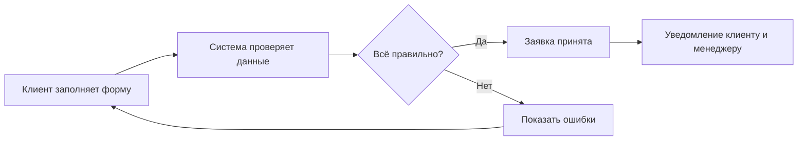
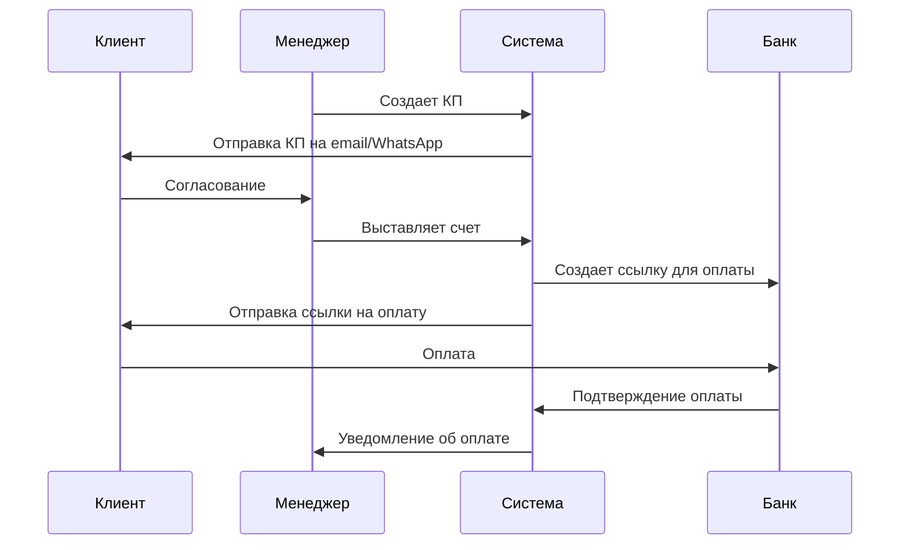
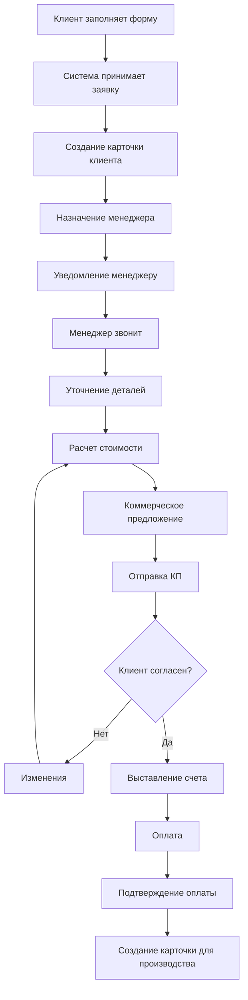

# Сценарий работы: Прием заявки и создание заказа

## Проблема заказчика

**Сейчас (без системы):**
- Заявки приходят из разных мест: сайт, email, Telegram, WhatsApp, звонки
- Менеджер вручную записывает всё в таблицы Excel
- Заявки часто теряются или записываются дважды
- Нет единого образца технического задания
- Невозможно посмотреть историю переписки с клиентом

**После внедрения системы:**
- Все заявки автоматически собираются в одном месте
- Система сама создает карточку заказа для производства
- Единый шаблон технического задания
- Вся история общения с клиентом сохраняется

---

## Участники процесса

| Кто | Что делает |
|-----|------------|
| **Клиент (частное лицо)** | Заполняет форму на сайте или пишет в мессенджер |
| **Клиент (компания)** | Отправляет заявку через личный кабинет или email |
| **Менеджер** | Обрабатывает заявку, уточняет детали, делает расчет |
| **Система** | Принимает заявки, проверяет правильность данных, создает карточки |

---

## Как это работает: от заявки до производства

### Шаг 1: Клиент заполняет форму на сайте

**Что указывает клиент:**
- Что нужно: зеркало или стекло
- Какой формы: прямоугольное, круглое, овальное, фигурное
- Размеры в миллиметрах
- Как обработать края: полировка, фацет и т.д.
- Дополнительные опции:
  - Подсветка (какая)
  - Отверстия для крепления
  - Тип креплений
- Контактные данные
- Адрес доставки (если нужна)

**Что происходит дальше:**



---

## Как это реализовано в разных вариантах

### Вариант 1: Решение на основе Битрикс24

**Что используется:**
- Битрикс24 (готовая платформа для управления бизнесом)
- Встроенные инструменты для CRM (управление клиентами)
- Модуль "Производство" от Битрикс

**Как работает:**
1. Форма на сайте отправляет данные в Битрикс24
2. Битрикс автоматически создает заявку (лид) в системе
3. Система назначает ответственного менеджера
4. Менеджер и клиент получают уведомления
5. Вся информация сохраняется в единой базе

**Что видит менеджер:**
- Стандартный интерфейс Битрикс24
- Карточку клиента со всей информацией
- История звонков и переписки (если подключена телефония)
- Кнопка "Позвонить" прямо из системы
- Калькулятор для расчета стоимости
- Кнопка для создания коммерческого предложения

---

### Вариант 2: Гибридное решение (Битрикс + свой интерфейс)

**Что используется:**
- Битрикс24 или Odoo (для хранения данных и управления клиентами)
- Собственный современный веб-интерфейс (специально разработанный)
- Промежуточный сервер для обработки данных

**Как работает:**
1. Форма на сайте отправляет данные на наш сервер
2. Сервер проверяет правильность и сохраняет в две базы:
   - В свою базу данных
   - В Битрикс/Odoo
3. Система рассылает уведомления всем участникам
4. Менеджер работает в удобном современном интерфейсе

**Что видит менеджер:**
- Красивый современный интерфейс (не Битрикс)
- Все нужное на одном экране
- Встроенный калькулятор стоимости
- История общения в удобном виде
- Быстрые кнопки для звонка, email, WhatsApp
- Перетаскивание заявок между статусами мышкой

**Преимущество:**
- Odoo (если выбран) имеет бесплатную версию и готовый модуль для производства
- Интерфейс создается под ваши задачи, а не подстраивается

---

### Вариант 3: Полностью своя система

**Что используется:**
- Полностью разработанная под вас система
- Собственная база данных
- Собственный интерфейс для каждой роли

**Как работает:**
1. Форма отправляет данные в вашу систему
2. Система проверяет и сохраняет данные
3. Автоматически создает номер заказа
4. Проверяет, есть ли уже этот клиент в базе
5. Рассылает уведомления по выбранным каналам
6. Назначает менеджера автоматически (по загрузке)

**Что видит менеджер:**
- Полностью свой интерфейс, заточенный под производство зеркал
- Мгновенное обновление информации без перезагрузки
- Умный калькулятор с подсказками
- Автоматические рекомендации по срокам
- Вся аналитика и графики
- Поиск по любым параметрам

---

### Шаг 2: Менеджер обрабатывает заявку

**Действия:**
1. Открывает заявку
2. Звонит клиенту для уточнения
3. Заполняет недостающую информацию
4. Рассчитывает стоимость
5. Создает коммерческое предложение

---

### Шаг 3: Согласование и оплата

**Процесс:**



---

### Шаг 4: Создание производственной карточки

**После оплаты система автоматически создает:**

```yaml
Заказ: #12345
Клиент: Иванов Иван Иванович
Телефон: +7 (999) 123-45-67
Дата: 25.11.2025

Что делаем:
  Тип: Зеркало настенное
  Форма: Прямоугольное
  Размеры: 800×1200 мм
  Толщина: 4 мм
  
Обработка:
  - Полировка кромки
  - Фацет 10 мм
  
Дополнительно:
  - 4 отверстия для креплений
  - Подсветка LED теплый белый
  
Сроки:
  Изготовление: 5 рабочих дней
  Готовность: 02.12.2025
  
Оплата: 15,000 ₽ (оплачено)
Менеджер: Петрова А.С.
```

---

## Сравнение вариантов решения

### Таблица: Основные характеристики

| Критерий | Вариант 1: Битрикс | Вариант 2: Гибрид | Вариант 3: Своя система |
|----------|-------------------|-------------------|------------------------|
| **Срок внедрения** | 2-3 месяца | 6-8 месяцев | 9-11 месяцев |
| **Стоимость разработки** | Средняя | Высокая | Очень высокая |
| **Ежемесячные платежи** | 12-25 тыс.₽ (лицензии) | 0-10 тыс.₽* | 0₽ (лицензий нет) |
| **Удобство для менеджеров** | Стандартное | Высокое | Максимальное |
| **Гибкость изменений** | Ограниченная | Хорошая | Полная |
| **Привязка к вендору** | Сильная | Средняя | Отсутствует |

*При использовании Odoo Community (бесплатная версия) или минимальной версии Битрикс

### Таблица: Преимущества и недостатки

| Вариант | ✅ Преимущества | ⚠️ Недостатки |
|---------|----------------|---------------|
| **1. Битрикс24** | • Быстрый запуск<br>• Всё в одном месте<br>• Готовая поддержка<br>• Не нужна большая команда разработчиков<br>• Известная платформа | • Высокая стоимость лицензий при росте<br>• Сложно менять под себя<br>• Интерфейс может быть избыточным<br>• Привязка к одному вендору<br>• Требует мощный сервер |
| **2. Гибридное** | • Удобный интерфейс для каждой роли<br>• Можно использовать бесплатный Odoo<br>• Легко добавлять новые функции<br>• Современный дизайн<br>• Меньшая зависимость от платформы | • Дольше разработка<br>• Нужно поддерживать две системы<br>• Сложнее в настройке<br>• Требует хороших разработчиков |
| **3. Своя система** | • Полностью под ваши процессы<br>• Нет платежей за лицензии<br>• Любые изменения когда нужно<br>• Максимальная скорость работы<br>• Полный контроль<br>• Можно продавать другим производствам | • Самые долгие сроки<br>• Самая высокая стоимость разработки<br>• Нужна сильная команда<br>• Всю поддержку делаете сами<br>• Больше рисков |

### Таблица: Для кого подходит

| Вариант | Рекомендуется, если: |
|---------|---------------------|
| **Битрикс24** | • Нужно запустить БЫСТРО (2-3 месяца)<br>• Ограничен бюджет на разработку<br>• Уже используете Битрикс<br>• Стандартные процессы<br>• Небольшая команда (до 50 человек) |
| **Гибридное** | • Хотите баланс скорости и качества<br>• Важен удобный интерфейс<br>• Планируете развивать систему<br>• Готовы подождать 6-8 месяцев<br>• Нравится идея использовать Odoo (бесплатно) |
| **Своя система** | • Производство - основа бизнеса<br>• Планируете сильно расти<br>• Нужны уникальные функции<br>• Готовы инвестировать в долгосрок<br>• Хотите полную независимость |

---

## Схема полного процесса



---

## Результаты внедрения

### Было (без системы):
- ⏱️ Время обработки заявки: **2-3 часа**
- ❌ Потеря заявок: **~15%**
- 📝 Ошибки в техзадании: **~20%**
- 📊 Руководитель не видит процесс

### Стало (с системой):
- ⚡ Время обработки: **15-30 минут**
- ✅ Потеря заявок: **0%**
- 📝 Ошибки в техзадании: **меньше 5%**
- 📊 Полная прозрачность для руководства
- 💰 Больше заказов переходят в оплату: **+25%**

---

## Дополнительные возможности

### Вариант 1: Битрикс
- Всё встроено в одну платформу
- Можно подключить IP-телефонию
- Готовые отчеты и аналитика
- Мобильное приложение для менеджеров

### Вариант 2: Гибрид
- Красивые современные интерфейсы
- Специальные дашборды для аналитики
- Упрощенная версия для производства
- Мобильная версия сайта работает без интернета

### Вариант 3: Полностью своё
- Интеллектуальные подсказки менеджеру
- Автоматический расчет оптимальных сроков
- Предсказание возможных проблем
- Любые отчеты под ваши задачи
- Интеграция с любыми системами

---

*Этот сценарий показывает, как система решает проблему потери заявок и автоматически создает задания для производства, экономя время менеджеров и улучшая качество работы.*
