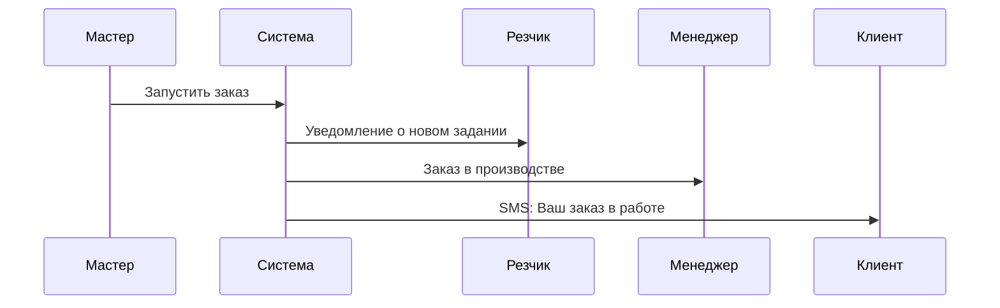
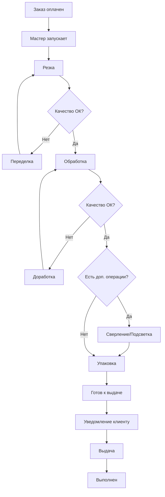

# Сценарий работы: Прохождение заказа через производство

## Проблема заказчика

**Сейчас (без системы):**

- Рабочие не знают, какие заказы делать в первую очередь
- Непонятно, на каком этапе находится каждый заказ
- Менеджеры не могут ответить клиенту, когда будет готов заказ
- Руководитель не видит, чем заняты цеха
- Статусы обновляются вручную в таблицах (или вообще не обновляются)
- Не видно, где происходят задержки

**После внедрения системы:**

- Рабочие видят очередь заказов с приоритетами
- Обновление статуса - одна кнопка
- Менеджеры и клиенты автоматически узнают о прогрессе
- Руководитель видит загрузку в реальном времени
- Полная история каждого заказа
- Система сама считает сроки готовности

---

## Участники процесса

| Кто                  | Что делает                                            |
| -------------------- | ----------------------------------------------------- |
| **Мастер-контролер** | Распределяет заказы между рабочими, следит за сроками |
| **Резчик**           | Режет материал по размерам                            |
| **Обработчик**       | Полирует края, делает фацет                           |
| **Монтажник**        | Сверлит отверстия, устанавливает подсветку            |
| **Упаковщик**        | Упаковывает готовое изделие                           |
| **Менеджер**         | Следит за своими заказами, общается с клиентами       |
| **Руководитель**     | Видит общую картину производства                      |

---

## Путь заказа через производство

**Пример: Заказ #12345 - Зеркало 800×1200 мм с подсветкой**

---

### Этап 1: Запуск в производство

**Мастер-контролер утром открывает систему:**

1. Видит список оплаченных заказов, ожидающих производства
2. Смотрит сроки и приоритеты
3. Проверяет наличие материала на складе
4. Назначает заказ конкретному рабочему (Иванову)
5. Нажимает "Запустить"

**Что происходит:**



---

## Как это реализовано в разных вариантах

### Вариант 1: Решение на основе Битрикс24

**Что используется:**

- Битрикс24 с модулем "Производство"
- Или раздел "Задачи и проекты"

**Как работает:**

- Мастер открывает Битрикс в браузере
- Видит список задач производства
- Перетаскивает заказ в нужный статус
- Назначает исполнителя из списка
- Битрикс отправляет email или push-уведомление рабочему

**Что видит рабочий:**

- Мобильное приложение Битрикс24 на телефоне
- Список своих заданий
- Кнопки "Начать работу", "Завершить", "Проблема"

**Особенности:**

- Всё в одной системе
- Стандартный интерфейс для всех
- Рабочим может быть сложновато (много лишних кнопок)

---

### Вариант 2: Гибридное решение (с собственным интерфейсом)

**Что используется:**

- Odoo (для учета) или Битрикс (как база данных)
- Простой веб-интерфейс специально для производства
- Промежуточный сервер связывает всё вместе

**Как работает:**

- Мастер открывает специальную производственную панель
- Видит доску с колонками этапов (как Trello)
- Перетаскивает карточки заказов между этапами
- Назначает исполнителя одним кликом
- Система обновляет и свою базу, и Odoo одновременно

**Что видит рабочий:**

- Простое приложение на планшете в цеху
- Только самое нужное: номер заказа, что делать
- Большая зеленая кнопка "Готово"
- Большая желтая кнопка "Проблема"
- Можно распечатать QR-код и сканировать его для открытия задания

**Особенности:**

- Удобно для каждой роли
- Если используется Odoo Community - бесплатно
- Работает даже без интернета (синхронизирует потом)

---

### Вариант 3: Полностью своя система

**Что используется:**

- Собственная система управления производством
- Специальное приложение для рабочих
- Автоматическая аналитика

**Как работает:**

- Мастер видит интерактивную доску производства
- Система сама подсказывает оптимальную очередность
- При назначении исполнителя учитывается его загрузка
- Все изменения видны мгновенно всем участникам

**Что видит рабочий:**

- Специальное простое приложение на телефоне/планшете
- Сканирует QR-код на задании - открывается всё нужное
- Одна кнопка для завершения
- Может сделать фото готовой работы (прикрепляется автоматически)
- Голосовое сообщение для передачи информации следующему этапу

**Особенности:**

- Максимально заточено под ваши процессы
- Подсказки и автоматизация
- Можно дополнить любыми функциями

---

### Этап 2: Резка материала

**Резчик (Иванов) получает уведомление:**

- В Telegram: "Новое задание: Заказ #12345"
- Или видит в своем списке задач

**Открывает задание и видит:**

```
Заказ #12345
Материал: Зеркало серебро, 4мм
Размер: 800×1200 мм
Форма: Прямоугольник
```

**Выполняет резку, затем:**

- Нажимает "Резка завершена" ✅

**Система автоматически:**

- Переводит заказ на следующий этап: "Обработка"
- Уведомляет обработчика Петрова о новом задании
- Обновляет прогресс: 25% готово

---

### Этап 3: Обработка кромки

**Обработчик (Петров) получает задание:**

Видит детали:

```
Обработка:
✓ Полировка кромки по периметру
✓ Фацет 10мм с лицевой стороны
Время: примерно 2 часа
```

**После выполнения:**

- Проверяет качество
- Если всё хорошо → "Обработка завершена"
- Если есть брак → "Проблема" и описывает

**При нажатии "Завершено":**

- Заказ переходит в "Дополнительные операции"
- Прогресс: 50%
- Уведомление монтажнику

---

### Этап 4: Дополнительные операции

**Монтажник (Сидоров) видит:**

```
Что нужно сделать:
• Сверление: 4 отверстия Ø6мм по углам
• Подсветка: LED-лента теплый белый
  Длина: 3.6м
```

**После выполнения:**

- Проверяет работу подсветки
- Делает фото (если система позволяет)
- Нажимает "Готово"

**Система:**

- Статус → "Упаковка"
- Прогресс: 75%

---

### Этап 5: Упаковка

**Упаковщик:**

1. Получает заказ
2. Упаковывает в защитную пленку и картон
3. Клеит стикер с номером заказа
4. Нажимает "Упаковка завершена"

**Система автоматически:**

- Статус → **"Готов к выдаче"**
- Прогресс: 100% ✅
- **Уведомление менеджеру:** "Заказ #12345 готов!"
- **Уведомление клиенту:** SMS/WhatsApp "Ваш заказ готов, можете забирать"
- Записывает местоположение на складе: "Полка А3"

---

### Этап 6: Выдача клиенту

**Менеджер:**

- Видит уведомление о готовности
- Звонит клиенту, договаривается о времени

**В день выдачи:**

- Находит заказ на складе по номеру
- Отдает клиенту
- Нажимает в системе "Выдано клиенту"
- Заказ переходит в статус **"Выполнен"** ✅

---

## Обработка проблем

### Ситуация: Обнаружен брак

**Обработчик видит скол на кромке:**

1. Нажимает "Проблема"
2. Выбирает: "Брак на предыдущем этапе"
3. Делает фото
4. Пишет: "Скол 3мм на нижней кромке"

**Система автоматически:**

- Уведомляет мастера (важное уведомление!)
- Уведомляет менеджера
- Возвращает заказ на этап "Резка"
- Пересчитывает срок: +1 день

**Мастер:**

- Видит проблему с фото
- Решает: переделать
- Назначает задачу резчику снова

**Менеджер:**

- Видит задержку
- Звонит клиенту, предупреждает о новом сроке

---

### Ситуация: Нет материала

**Резчик открыл задание, но нужного материала нет:**

1. Нажимает "Проблема"
2. Выбирает "Нет материала"

**Система:**

- Статус заказа → "Ожидание материала"
- Уведомление менеджеру по закупкам
- Заказ временно убирается из очереди производства

**Когда материал привезли:**

- Менеджер по закупкам нажимает "Материал поступил"
- Заказ автоматически возвращается в очередь

---

## Мониторинг для руководителя

**Руководитель открывает дашборд и видит:**

```yaml
Производство сегодня:
  В работе: 23 заказа
  Готово: 8 заказов
  Средний срок: 4.2 дня (план: 5 дней) ✅

Где сейчас заказы:
  Резка: 3 заказа
  Обработка: 7 заказов ⚠️ Много
  Доп. операции: 2 заказа
  Упаковка: 1 заказ

Загрузка рабочих:
  Иванов (Резка): Занят
  Петров (Обработка): Занят
  Сидоров (Монтаж): Свободен

Проблемы:
  ⚠️ Заказ #12340 - задержка 2 дня (нет материала)
  ⚠️ Заказ #12335 - брак, переделка
```

**Видит график - где узкие места**
**Может принять решение о найме или перераспределении**

---

## Схема производственного цикла



---

## Сравнение вариантов решения

### Таблица: Основные характеристики

| Критерий                       | Вариант 1: Битрикс      | Вариант 2: Гибрид           | Вариант 3: Своя система |
| ------------------------------ | ----------------------- | --------------------------- | ----------------------- |
| **Удобство для рабочих**       | Среднее (много лишнего) | Высокое (простой интерфейс) | Максимальное (заточено) |
| **Удобство для мастера**       | Хорошее                 | Отличное                    | Максимальное            |
| **Работа без интернета**       | Нет                     | Да (с синхронизацией)       | Да                      |
| **Скорость обновления данных** | Средняя                 | Быстрая                     | Мгновенная              |
| **Аналитика для руководителя** | Стандартная             | Продвинутая                 | Любая нужная            |
| **Мобильное приложение**       | Есть (Битрикс24)        | Простое веб-приложение      | Специальное приложение  |

### Таблица: Преимущества и недостатки

| Вариант                                | ✅ Преимущества                                                                                                                                                            | ⚠️ Недостатки                                                                                                                                            |
| -------------------------------------- | -------------------------------------------------------------------------------------------------------------------------------------------------------------------------- | -------------------------------------------------------------------------------------------------------------------------------------------------------- |
| **1. Битрикс24**                       | • Готовый модуль "Производство"<br>• Всё в одной системе<br>• Не нужно много разработки<br>• Есть мобильное приложение<br>• Техподдержка от вендора                        | • Интерфейс сложноват для рабочих<br>• Много лишних кнопок и меню<br>• Не работает без интернета<br>• Платная лицензия<br>• Сложно добавить свои функции |
| **2. Гибридное (Odoo/свой интерфейс)** | • Простой интерфейс для рабочих<br>• Odoo бесплатный и мощный<br>• Работает без интернета<br>• Удобная доска для мастера<br>• Можно добавлять функции                      | • Дольше внедрение<br>• Нужны разработчики<br>• Две системы для поддержки<br>• Сложнее в настройке                                                       |
| **3. Полностью своя**                  | • Максимально удобно каждому<br>• QR-коды, фото, голосовые заметки<br>• Умные подсказки<br>• Любые функции по желанию<br>• Нет плат за лицензии<br>• Мгновенные обновления | • Самое дорогое внедрение<br>• Длительная разработка<br>• Нужна команда для поддержки<br>• Больше рисков<br>• Всё делаете сами                           |

### Таблица: Для кого подходит

| Вариант          | Рекомендуется, если:                                                                                                                                                                         |
| ---------------- | -------------------------------------------------------------------------------------------------------------------------------------------------------------------------------------------- |
| **Битрикс24**    | • Небольшое производство (до 20-30 заказов в день)<br>• Рабочие могут освоить сложный интерфейс<br>• Нужна быстрая автоматизация<br>• Уже есть Битрикс для CRM                               |
| **Гибридное**    | • Важно удобство для производственников<br>• Хотите использовать бесплатный Odoo<br>• Нужен простой планшет в цеху<br>• Планируете расширение производства<br>• Интернет в цеху нестабильный |
| **Своя система** | • Производство - ваш главный процесс<br>• Уникальные операции и процессы<br>• Планируете масштабный рост<br>• Нужны специальные функции<br>• Готовы инвестировать в разработку               |

---

## Результаты внедрения

### Было (без системы):

- ⏱️ Средний срок производства: **7-10 дней**
- ❓ Менеджеры постоянно бегают в цех узнавать статус
- 📊 Руководитель узнает о проблемах поздно
- 🔧 Переделки из-за ошибок: **~10%**
- 😟 Рабочие не знают приоритеты

### Стало (с системой):

- ⚡ Средний срок: **4-5 дней** (на 40% быстрее!)
- ✅ Менеджеры видят всё в системе
- 📊 Руководитель видит проблемы сразу
- 🔧 Переделки: **менее 3%**
- 😊 Четкая очередь заказов для всех
- 📈 Производительность: **+40%**
- 🎯 Соблюдение сроков: **95%** (было 60%)

---

## Дополнительные возможности

### Вариант 1: Битрикс

- История всех действий по заказу
- Автоматические отчеты по производству
- Учет времени на каждый этап
- Связь с CRM и складом

### Вариант 2: Гибрид

- Красивые графики загрузки
- Печать этикеток со штрих-кодом
- Фото-отчеты этапов работы
- Планирование загрузки на неделю вперед
- Работа на планшетах в цеху без интернета

### Вариант 3: Полностью своё

- Умное планирование очередности
- Предсказание задержек
- Автоматические подсказки рабочим
- Голосовые команды
- Интеграция с любым оборудованием
- Обучение новых сотрудников прямо в системе
- Расчет зарплаты по выполненным заказам

---

_Этот сценарий показывает, как система делает производство прозрачным и управляемым, сокращая сроки изготовления и повышая качество продукции._
