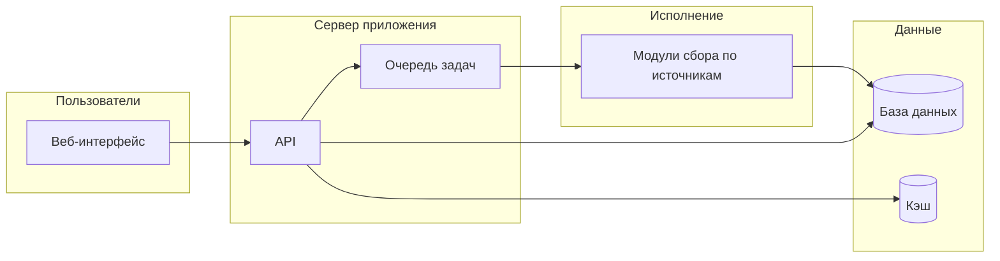

# Платон

## Единая картина цен и наличия по вашим подключаемым источникам — без ручного сбора в десяти вкладках

---

# Боль рынка: данные есть, порядка нет

## Прайсы прилетают в почту и Excel — и устаревают в тот же день

- Разные форматы, дубли, ручной перенос → ошибки в котировках и закупках.
- «Кто сейчас дешевле по этой позиции?» — ответ требует открыть несколько сайтов и таблиц.
- У поставщиков — защита от роботов и нестабильные страницы; внутренний скрипт «на коленке» постоянно ломается.
- Руководство просит сводку, а команда тратит часы на подготовку среза вместо работы с клиентами.

---

# Что даёт Платон — одной фразой

## Одно окно для команды: позиции, ссылки на карточки у ваших поставщиков, актуальные цены и статусы после обхода

- Номенклатура и привязка к страницам источников — в одном месте.
- Обновление данных запускается осознанно: по позиции или массово — под ваш процесс.
- История и сводки помогают видеть динамику, а не случайный скриншот «на сейчас».

---

# Где выгодно бизнесу

## Скорость, маржа, прозрачность — без привязки к конкретным площадкам

- **Котировки и тендеры** — меньше времени от запроса до цифры; конкурентные предложения собираются системно, а не «кто успел вручную».
- **Продажи** — ниже риск предложить цену из устаревшего прайса или перепутать поставщика.
- **Закупки** — видно расхождение по источникам в одной строке; проще договариваться и переключать поставку.
- **Руководство** — регулярная картина по ключевым позициям без Excel-рутины на часы в неделю (подставьте ваши KPI сами).

---

# Кому внутри компании становится проще

## Роли под реальные задачи — каждый видит своё

- **Закупки** — сравнение условий по вашим подключённым источникам без прыжков по сайтам.
- **Сейлз** — актуальные ориентиры по цене и доступности для ответа клиенту.
- **Аналитика** — сводки, дайджесты изменений, опора для отчётов без ручной сводки таблиц.
- **Администрирование и ИТ** — очередь задач, учётные записи к источникам, при необходимости прокси и настройки среды — контроль без хаоса в скриптах.

---

# Было и стало

## Два состояния одного процесса

| Было                                                      | Стало                                                                                           |
| --------------------------------------------------------- | ----------------------------------------------------------------------------------------------- |
| Часы на ручной сбор и сверку                              | Минуты на запуск обновления и просмотр результата в интерфейсе                                  |
| Ошибки переноса и «человеческий фактор»                   | Единый формат данных в системе                                                                  |
| Непонятно, когда данные последний раз актуализировали     | История задач и снимков — прозрачный аудит                                                      |
| Каждый новый поставщик = новый мини-проект у разработчика | Расширяемая архитектура: новый источник подключается модулем, интерфейс для пользователя тот же |

---

# Каталог позиций и цен

## Сводная таблица по вашим источникам — поиск, фильтры, теги

- Все позиции с привязкой к URL у выбранных поставщиков в одном представлении.
- Фильтрация по источнику, категориям и тегам — чтобы работать с нужным срезом номенклатуры.
- Поиск по названию и артикулу — быстрый доступ к позиции в большом каталоге.
- Запуск обновления данных — точечно или массово, в зависимости от регламента.

---

# Несколько поставщиков — одна картина

## Иллюстрация на вымышленных именах (замените на своих)

- Условный **«Все инструменты»** (маркетплейс или агрегатор каталога) и оптовик **«Зубр»** — в одной строке интерфейса видны цены и статусы с обоих направлений.
- Такой пример показывает **логику сравнения**, а не готовый список интеграций: состав источников определяется вашим договором и внедрением.
- Новый поставщик = отдельный модуль сбора под ваш домен; для пользователя — тот же экран и те же отчёты.

---

# Роли и безопасность доступа

## Кто настраивает, кто ведёт данные, кто потребляет аналитику

- **Администратор** — полный контур: администрирование парсинга, настройки, учётные данные к источникам, прокси при необходимости, управление продуктами, аналитика.
- **Специалист по номенклатуре** — ведение продуктов и ссылок, запуск задач обхода; фокус на качестве привязок.
- **Менеджер по продажам** — просмотр продуктов и цен, работа с тегами, аналитика; без доступа к «тяжёлой» админке.
- **Аналитик** — продукты и аналитика, теги; удобно готовить обзоры без риска сломать настройки.

---

# Администрирование парсинга

## Очередь, массовые обходы, история и детализация задач

- Статус очереди и активные задачи — видно нагрузку и прогресс без обращения к логам на сервере.
- Массовый запуск обходов — для регламентного обновления большого пласта позиций.
- История задач и карточка задачи — что прошло, что упало, где смотреть детали.
- Настройки среды, учётные записи для входа на сайты поставщиков, прокси — вынесены в административный раздел (без привязки к именам конкретных площадок в тексте для заказчика).

---

# Аналитика

## Сводки, дайджест изменений, история цены по позиции

- Сводные показатели по работе системы и данным — опора для контроля процесса.
- Дайджест уведомлений и изменений — быстрее увидеть, что «пошевелилось» на рынке по вашим позициям.
- История цены по выбранной позиции — **тренд**, а не разовый снимок; удобно для переговоров и внутренних отчётов.

---

# Надёжность и масштабирование

## Технологии, на которых спокойно строить процесс

- **Асинхронная очередь задач** — обходы не блокируют интерфейс; нагрузка распределяется предсказуемо.
- **Повторы при сбоях** — временные ошибки сети или сайта не обязаны ронять весь прогон.
- **Хранение в базе данных и кэш** — данные не живут только в памяти одной сессии браузера.
- **HTTP API и документация** — возможность встроить Платон в ваш контур (CRM, внутренние отчёты) без дублирования логики сбора.

---

# Работа со «сложными» сайтами

## Когда простого запроса недостаточно

- Реалистичные интервалы между запросами и работа в рамках сессии — меньше триггеров антибот-защиты.
- Пул сессий и обходные сценарии при деградации доступа — устойчивость к типичным отказам.
- **Прокси под вашу инфраструктуру** — при необходимости выход в интернет через ваши адреса, без привязки «всё держится на одном поставщике».

---

# Архитектура в одном слайде

## От экрана пользователя до хранилища

Кратко: интерфейс обращается к API; заявки на обход ставятся в очередь; исполнители ходят к **вашим** сайтам-поставщикам и складывают результат в хранилище; пользователь видит единый срез.

---

# Итог и следующий шаг

## Пилот на вашей номенклатуре — подключение ваших источников — сопровождение

- **Платон** снимает рутину сбора и даёт единую точку правды по ценам и статусам для команд закупок, продаж и аналитики.
- Состав источников и глубина каталога определяются вашим бизнесом, а не фиксированным «коробочным» списком сайтов.
- Логичный следующий шаг: пилот на ограниченном наборе позиций и поставщиков, затем масштабирование и доработка модулей под новые площадки.

---

## Примечание для переноса в слайды

Каждый блок с заголовком уровня `#` выше — отдельный слайд в PowerPoint или Google Slides. Подзаголовки `##` — подзаголовок на том же слайде или второй слайд, если места мало. Диаграмму можно вставить как скриншот экспорта Mermaid или перерисовать в фирменных цветах.
