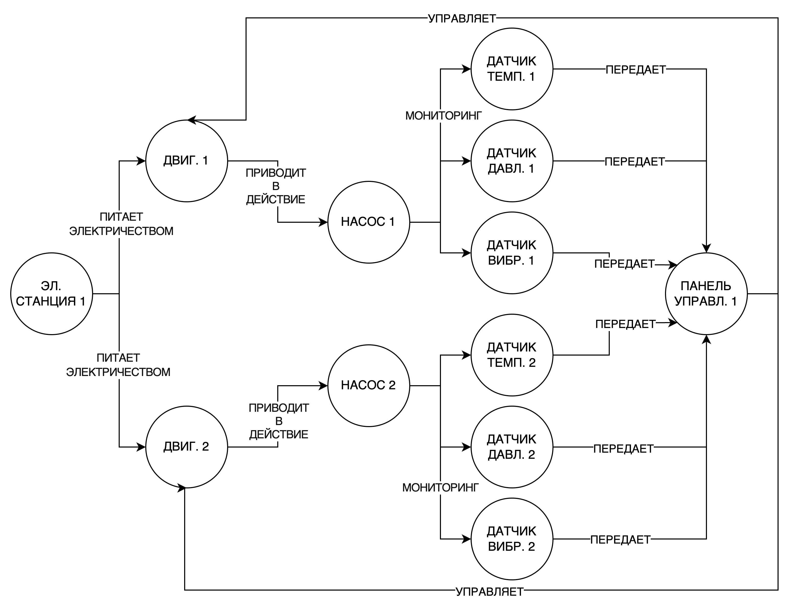
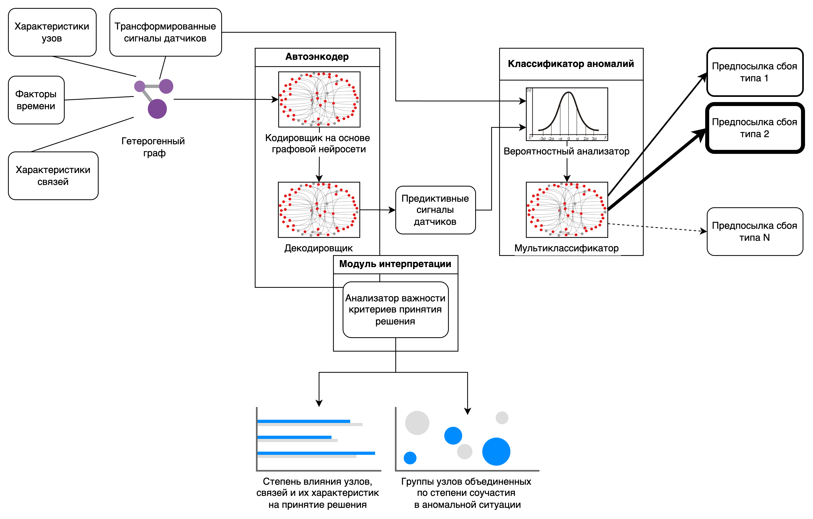

**Суть ML решения**

В основе метода лежат механизмы автоматического выявления шаблона
поведения всей системы целиком и отдельных узлов оборудования в
контексте их взаимодействия друг с другом.

**Необходимые данные**

1.  Характеристики узлов оборудования

2.  Характеристики взаимодействия оборудования друг с другом

3.  Факторы времени, включая календарные признаки и признаки регулярных
    или специальных событий.

4.  Сигналы датчиков оборудования.

5.  Схема взаимодействия узлов оборудования.

**Представление данных в виде графа**

Все эти данные объединяются в **гетерогенный граф**, где вершинами
являются узлы оборудования, ребрами являются взаимосвязи между узлами
оборудования, а остальные данные распределяются между вершинами и
ребрами в виде информационных векторов.

Граф называется **гетерогенным**, если он объединяет разные типы вершин
и разные типы связей.

**Пример части гетерогенного графа**

{width="6.6930555555555555in"
height="5.122916666666667in"}

**Архитектура ML решения**

Основываясь на такой структуре данных решение представляет собой каскад
двух подсистем:

1.  **Автоенкодер**. Он выучивает шаблон поведения связанной системы и
    ее узлов.

2.  **Классификатор**. Он фильтрует найденные аномалии как разницу между
    сигналами устройств и шаблоном сокращая количество "ложных аномалий"
    , а затем классифицирует аномалии как предпосылки известных типов
    сбоев.

{width="6.6930555555555555in"
height="4.279861111111111in"}

**Автоенкодер**

В основе структуры автоенкодера лежат:

**Кодировщик**

Он представляет собой многослойную **графовую нейронную сеть**, которая
выучивает характер поведения всех устройств оборудования,
представленного в графе, используя характеристики узлов, связей,
временные факторы, сигналы устройств. На выходе котировщика мы получаем
для каждого узла представление в виде поведенческого **эмбеддинга** в
едином векторном пространстве.

**Декодировщик**

Он из поведенческих **эмбеддинга** восстанавливает сигналы устройств на
основе выученного шаблона.

**Модуль интерпретации**

Он определяет какие узлы и связи повлияли на формирование аномальных
ситуаций и объединяет их группы-соучастников аномальных событий.

**Классификатор**

Он состоит из:

1.  **Вероятностного анализатора**, который путем проверки гипотезы
    распределения выделяет только истинные аномалии.

2.  **Мультиклассификатора,** который определяет последовательность
    аномальны событий как предпосылку сбоя одного из известных типов.

**Преимущества графовых нейросетей (GNN)**

**Учёт локальных и глобальных взаимосвязей**

**Графовые нейросети** способны захватывать как локальные свойства узлов
(локальная структура соседей узла), так и глобальные характеристики
графа (структурные шаблоны, возникающие на уровне всего графа). Это
позволяет эффективно находить необычные образцы, выходящие за рамки
нормального поведения.

**Обобщённая обработка разнородных данных**

GNN умеют объединять численные, категориальные и текстовые данные в
одном графовом представлении, обеспечивая комплексный подход к поиску
аномалий. Это критично для ситуаций, когда стандартные алгоритмы
машинного обучения испытывают трудности с совмещением разнотипных
признаков.

**Способность к работе с неполными или зашумлёнными данными**

Поскольку графовые нейросети используют не только сами вершины (узлы),
но и связи между ними, они могут компенсировать отсутствие или ошибку
отдельных характеристик узла, полагаясь на косвенную информацию от
соседних элементов. Это повышает устойчивость моделей к некорректным или
отсутствующим данным.

**Высокая чувствительность к отклонениям структуры**

Аномалии часто проявляются как отклонения в структуре графа (например,
необычное количество соседей, изменение веса связей или появление
атипичных кластеров). Графовые нейросети отлично приспособлены для
выявления таких структурных изменений, которые классические методы
распознавания изображений или временных рядов могли бы пропустить.

**Масштабируемость и применимость к большим графам**

Современные графовые нейросети разрабатываются с учётом вычислительной
эффективности и параллельной обработки данных. Это позволяет применять
их к огромным графам, содержащим миллионы или миллиарды узлов, сохраняя
приемлемую скорость обучения и вывода.

**Опыт разработки и применения ML решения**

**Поиск аномалий для e-commerce платформы компании Kohl's**

Компания Kohl\'s (Милпитас, США) является известной американской
розничной торговой сетью, специализирующейся на продаже одежды, обуви,
аксессуаров, товаров для дома и косметики. Основанная в 1962 году,
компания продолжает оставаться значимым игроком на рынке ритейла,
несмотря на сложную конкуренцию и экономические вызовы.

Компания Kohl's обоадает собственной e-commerce платформой содержащую
огромный список сервисов таких как каталог товаров, умный поиск,
рекомендательная система, персонализированное ценообразование, система
предложений и скидок, сервисы комплектации заказов, доставки и
распределения. e-commerce система реализована с использованием сотен
виртуальных серверов на облачной платформе.

Задача состояла в раннем обнаружении аномального поведения сервисов
e-commerce платформы, а также системных приложений и состояния
виртуальных серверов через логи ошибок, сервизных и системных метрик.

Автоматическое получение аномальных состояний и их качественная
классификация позволили своевременно реагировать путем исправления
ошибок, осуществления процедур масштабирования вычислительных ресурсов,
и т.д. Особенно это оказалось важным в момент пиковой нагрузки на
e-commerce платформу, что позволило значительно сократить финансовые
потери и стоимость поддержки.

**Поиск неисправностей в работе оборудования заправочных станций для
Vontier Corporation**

Компания Vontier Corporation (Сиэтл, США) приобрела подразделение
Gilbarco Veeder-Root в результате выделения подразделения Danaher
Corporation в отдельную компанию в декабре 2020 года. С тех пор Gilbarco
Veeder-Root стала ключевой составляющей портфолио Vontier,
специализирующегося на предоставлении инновационных решений для
автозаправочных станций, коммерческих топливозаправочных комплексов и
смежных рынков.

Основные направление деятельности Gilbarco Veeder-Root:

1.  Производство высокотехнологичных топливоразливочных колонок и
    сопутствующего оборудования.

2.  Решения для оплаты топлива и управление розничными операциями на
    АЗС.

3.  Средства учета и автоматизации процессов на автозаправочных
    комплексах.

Задача состояла в разработке системы автоматического поиска аномального
поведения устройств топливозаправочного оборудования.

Реализация решения позволила сократить объемы потерь топлива при
некорректной работе измерительных приборов, своевременно оказывать
сервиcное обслуживание помп топливных танков.
